# Database Design: OpenResty Distributed Rate Limiting System for Storage QoS

## Table of Contents
1. [System Overview](#system-overview)
2. [Entity Relationship Diagram](#entity-relationship-diagram)
3. [Detailed Schema Design](#detailed-schema-design)
4. [Index Design](#index-design)
5. [Partitioning Strategy](#partitioning-strategy)
6. [Sample SQL Scripts](#sample-sql-scripts)
7. [Query Patterns](#query-patterns)
8. [Data Retention Policy](#data-retention-policy)
9. [Performance Optimization](#performance-optimization)

---

## System Overview

This database supports a three-layer token bucket rate limiting system for cloud storage QoS:

- **L1 (Cluster Layer)**: Global cluster-level rate limiting
- **L2 (Application Layer)**: Per-application/tenant rate limiting
- **L3 (Local Cache Layer)**: In-memory caching (not persisted)

**Cost Model**: `Cost = C_base + (Size_body / Unit_quantum) × C_bw`

**Key Features**:
- Multi-tenant storage access control
- Token borrowing with interest
- Configuration versioning and audit trails
- Real-time metrics and historical analysis
- Role-based access control

---

## Entity Relationship Diagram

```mermaid
erDiagram
    tenants ||--o{ applications : owns
    applications ||--o{ quota_configs : has
    applications ||--o{ token_buckets : manages
    applications ||--o{ metrics : generates
    applications ||--o{ audit_logs : creates

    clusters ||--o{ applications : hosts

    quota_configs ||--o{ quota_version_history : tracks

    operation_types ||--o{ cost_rules : defines

    token_buckets ||--o{ token_transactions : records
    token_buckets ||--o{ token_borrowing : tracks

    users ||--o{ user_roles : has
    roles ||--o{ user_roles : assigns
    roles ||--o{ role_permissions : grants
    permissions ||--o{ role_permissions : includes

    users ||--o{ audit_logs : creates

    applications ||--o{ alert_configs : has
    alert_configs ||--o{ alert_history : triggers

    applications ||--o{ iops_quotas : has
    applications ||--o{ bandwidth_quotas : has

    tenants {
        uuid tenant_id PK
        string name
        string description
        timestamp created_at
        timestamp updated_at
        boolean is_active
    }

    applications {
        uuid app_id PK
        uuid tenant_id FK
        uuid cluster_id FK
        string name
        string api_key
        jsonb metadata
        timestamp created_at
        timestamp updated_at
        boolean is_active
    }

    clusters {
        uuid cluster_id PK
        string name
        string region
        string endpoint
        integer max_capacity
        timestamp created_at
        timestamp updated_at
    }

    quota_configs {
        uuid config_id PK
        uuid app_id FK
        timestamp valid_from
        timestamp valid_to
        boolean is_active
        timestamp created_at
    }

    iops_quotas {
        uuid quota_id PK
        uuid config_id FK
        integer iops_limit
        integer iops_burst
        integer burst_duration_seconds
        integer refill_rate
        string calculation_method
    }

    bandwidth_quotas {
        uuid quota_id PK
        uuid config_id FK
        integer bandwidth_limit_bps
        integer bandwidth_burst_bps
        integer burst_duration_seconds
        integer refill_rate_bps
    }

    token_buckets {
        uuid bucket_id PK
        uuid app_id FK
        string bucket_type
        integer capacity
        integer current_tokens
        integer refill_rate
        timestamp last_refill_at
        timestamp created_at
        timestamp updated_at
    }

    token_transactions {
        uuid transaction_id PK
        uuid bucket_id FK
        integer tokens_change
        string transaction_type
        decimal balance_after
        timestamp created_at
        string reference_id
    }

    token_borrowing {
        uuid borrowing_id PK
        uuid bucket_id FK
        uuid from_bucket_id FK
        integer tokens_borrowed
        integer repayment_tokens
        decimal interest_rate
        timestamp borrowed_at
        timestamp due_at
        timestamp repaid_at
        string status
    }

    operation_types {
        uuid operation_id PK
        string name
        string category
        decimal c_base
        integer unit_quantum
        decimal c_bw
        boolean is_active
    }

    cost_rules {
        uuid rule_id PK
        uuid operation_id FK
        uuid app_id FK
        decimal c_base_override
        decimal c_bw_override
        timestamp valid_from
        timestamp valid_to
        boolean is_active
    }

    quota_version_history {
        uuid version_id PK
        uuid config_id FK
        uuid app_id FK
        jsonb old_config
        jsonb new_config
        string change_reason
        uuid changed_by FK
        timestamp changed_at
    }

    metrics {
        uuid metric_id PK
        uuid app_id FK
        timestamp timestamp
        string metric_name
        double value
        jsonb tags
        string unit
    }

    iops_metrics {
        uuid metric_id PK
        uuid app_id FK
        timestamp timestamp
        integer read_ops
        integer write_ops
        integer total_ops
        double avg_latency_ms
        jsonb tags
    }

    bandwidth_metrics {
        uuid metric_id PK
        uuid app_id FK
        timestamp timestamp
        integer bytes_read
        integer bytes_written
        integer total_bytes
        double avg_throughput_mbps
        jsonb tags
    }

    audit_logs {
        uuid log_id PK
        uuid app_id FK
        uuid user_id FK
        string action
        string entity_type
        uuid entity_id
        jsonb old_values
        jsonb new_values
        string ip_address
        string user_agent
        timestamp created_at
    }

    users {
        uuid user_id PK
        uuid tenant_id FK
        string username
        string email
        string password_hash
        timestamp created_at
        timestamp updated_at
        boolean is_active
        timestamp last_login_at
    }

    roles {
        uuid role_id PK
        string name
        string description
        timestamp created_at
        timestamp updated_at
    }

    permissions {
        uuid permission_id PK
        string resource
        string action
        string description
    }

    user_roles {
        uuid user_role_id PK
        uuid user_id FK
        uuid role_id FK
        timestamp assigned_at
        uuid assigned_by FK
    }

    role_permissions {
        uuid role_permission_id PK
        uuid role_id FK
        uuid permission_id FK
        timestamp granted_at
        uuid granted_by FK
    }

    alert_configs {
        uuid alert_id PK
        uuid app_id FK
        string metric_name
        string condition
        double threshold_value
        integer duration_seconds
        string severity
        boolean is_active
        jsonb notification_config
        timestamp created_at
        timestamp updated_at
    }

    alert_history {
        uuid history_id PK
        uuid alert_id FK
        uuid app_id FK
        string status
        double actual_value
        double threshold_value
        timestamp triggered_at
        timestamp resolved_at
        jsonb notification_sent
        string description
    }

    system_settings {
        uuid setting_id PK
        string key
        string value
        string description
        timestamp updated_at
        uuid updated_by FK
    }
```



---

## Detailed Schema Design

### 1. Tenants Table
**Purpose**: Top-level organization/tenant management for multi-tenancy support.

```sql
CREATE TABLE tenants (
    tenant_id UUID PRIMARY KEY DEFAULT gen_random_uuid(),
    name VARCHAR(255) NOT NULL UNIQUE,
    description TEXT,
    is_active BOOLEAN DEFAULT true,
    created_at TIMESTAMP WITH TIME ZONE DEFAULT CURRENT_TIMESTAMP,
    updated_at TIMESTAMP WITH TIME ZONE DEFAULT CURRENT_TIMESTAMP,
    CONSTRAINT tenant_name_not_empty CHECK (LENGTH(TRIM(name)) > 0)
);

CREATE INDEX idx_tenants_active ON tenants(is_active) WHERE is_active = true;
CREATE INDEX idx_tenants_name ON tenants USING gin(to_tsvector('english', name));
```

### 2. Clusters Table
**Purpose**: L1 cluster configuration for distributed system management.

```sql
CREATE TABLE clusters (
    cluster_id UUID PRIMARY KEY DEFAULT gen_random_uuid(),
    name VARCHAR(255) NOT NULL UNIQUE,
    region VARCHAR(100) NOT NULL,
    endpoint VARCHAR(500),
    max_capacity BIGINT DEFAULT 0,
    health_status VARCHAR(50) DEFAULT 'unknown',
    health_check_url VARCHAR(500),
    created_at TIMESTAMP WITH TIME ZONE DEFAULT CURRENT_TIMESTAMP,
    updated_at TIMESTAMP WITH TIME ZONE DEFAULT CURRENT_TIMESTAMP,
    CONSTRAINT cluster_status_check
        CHECK (health_status IN ('healthy', 'degraded', 'unhealthy', 'unknown'))
);

CREATE INDEX idx_clusters_region ON clusters(region);
CREATE INDEX idx_clusters_status ON clusters(health_status);
```

### 3. Applications Table
**Purpose**: L2 application/tenant configuration for rate limiting.

```sql
CREATE TABLE applications (
    app_id UUID PRIMARY KEY DEFAULT gen_random_uuid(),
    tenant_id UUID NOT NULL REFERENCES tenants(tenant_id) ON DELETE RESTRICT,
    cluster_id UUID REFERENCES clusters(cluster_id) ON DELETE SET NULL,
    name VARCHAR(255) NOT NULL,
    api_key VARCHAR(255) UNIQUE NOT NULL,
    api_key_hash VARCHAR(255) UNIQUE NOT NULL,
    metadata JSONB DEFAULT '{}'::jsonb,
    is_active BOOLEAN DEFAULT true,
    created_at TIMESTAMP WITH TIME ZONE DEFAULT CURRENT_TIMESTAMP,
    updated_at TIMESTAMP WITH TIME ZONE DEFAULT CURRENT_TIMESTAMP,
    CONSTRAINT app_tenant_name_unique UNIQUE (tenant_id, name),
    CONSTRAINT app_name_not_empty CHECK (LENGTH(TRIM(name)) > 0)
);

CREATE INDEX idx_applications_tenant ON applications(tenant_id);
CREATE INDEX idx_applications_cluster ON applications(cluster_id);
CREATE INDEX idx_applications_api_key ON applications(api_key);
CREATE INDEX idx_applications_active ON applications(is_active) WHERE is_active = true;
CREATE INDEX idx_applications_metadata ON applications USING gin(metadata);
```

### 4. Quota Configurations Table
**Purpose**: Main quota configuration with time-based validity.

```sql
CREATE TABLE quota_configs (
    config_id UUID PRIMARY KEY DEFAULT gen_random_uuid(),
    app_id UUID NOT NULL REFERENCES applications(app_id) ON DELETE CASCADE,
    valid_from TIMESTAMP WITH TIME ZONE NOT NULL,
    valid_to TIMESTAMP WITH TIME ZONE,
    is_active BOOLEAN DEFAULT true,
    created_at TIMESTAMP WITH TIME ZONE DEFAULT CURRENT_TIMESTAMP,
    CONSTRAINT quota_time_overlap_check EXCLUDE USING gist (
        app_id WITH =,
        tsrange(valid_from, COALESCE(valid_to, 'infinity'::timestamp)) WITH &&
    )
);

CREATE INDEX idx_quota_configs_app ON quota_configs(app_id);
CREATE INDEX idx_quota_configs_active ON quota_configs(is_active) WHERE is_active = true;
CREATE INDEX idx_quota_configs_time ON quota_configs(valid_from, valid_to);
```

### 5. IOPS Quotas Table
**Purpose**: IOPS-specific quota settings.

```sql
CREATE TABLE iops_quotas (
    quota_id UUID PRIMARY KEY DEFAULT gen_random_uuid(),
    config_id UUID NOT NULL REFERENCES quota_configs(config_id) ON DELETE CASCADE,
    iops_limit INTEGER NOT NULL CHECK (iops_limit > 0),
    iops_burst INTEGER NOT NULL CHECK (iops_burst >= iops_limit),
    burst_duration_seconds INTEGER NOT NULL CHECK (burst_duration_seconds > 0),
    refill_rate INTEGER NOT NULL CHECK (refill_rate > 0),
    calculation_method VARCHAR(50) DEFAULT 'token_bucket'
        CHECK (calculation_method IN ('token_bucket', 'leaky_bucket', 'fixed_window')),
    min_reserve INTEGER DEFAULT 0 CHECK (min_reserve >= 0)
);

CREATE INDEX idx_iops_quotas_config ON iops_quotas(config_id);
```

### 6. Bandwidth Quotas Table
**Purpose**: Bandwidth-specific quota settings (bytes/second).

```sql
CREATE TABLE bandwidth_quotas (
    quota_id UUID PRIMARY KEY DEFAULT gen_random_uuid(),
    config_id UUID NOT NULL REFERENCES quota_configs(config_id) ON DELETE CASCADE,
    bandwidth_limit_bps BIGINT NOT NULL CHECK (bandwidth_limit_bps > 0),
    bandwidth_burst_bps BIGINT NOT NULL CHECK (bandwidth_burst_bps >= bandwidth_limit_bps),
    burst_duration_seconds INTEGER NOT NULL CHECK (burst_duration_seconds > 0),
    refill_rate_bps BIGINT NOT NULL CHECK (refill_rate_bps > 0)
);

CREATE INDEX idx_bandwidth_quotas_config ON bandwidth_quotas(config_id);
```

### 7. Token Buckets Table
**Purpose**: Current state of token buckets for L1 and L2 layers.

```sql
CREATE TABLE token_buckets (
    bucket_id UUID PRIMARY KEY DEFAULT gen_random_uuid(),
    app_id UUID NOT NULL REFERENCES applications(app_id) ON DELETE CASCADE,
    bucket_type VARCHAR(50) NOT NULL CHECK (bucket_type IN ('iops_l1', 'iops_l2', 'bandwidth_l1', 'bandwidth_l2')),
    capacity BIGINT NOT NULL CHECK (capacity > 0),
    current_tokens BIGINT NOT NULL CHECK (current_tokens >= 0 AND current_tokens <= capacity),
    refill_rate BIGINT NOT NULL CHECK (refill_rate > 0),
    last_refill_at TIMESTAMP WITH TIME ZONE NOT NULL,
    created_at TIMESTAMP WITH TIME ZONE DEFAULT CURRENT_TIMESTAMP,
    updated_at TIMESTAMP WITH TIME ZONE DEFAULT CURRENT_TIMESTAMP,
    CONSTRAINT token_bucket_app_type_unique UNIQUE (app_id, bucket_type)
);

CREATE INDEX idx_token_buckets_app ON token_buckets(app_id);
CREATE INDEX idx_token_buckets_type ON token_buckets(bucket_type);
CREATE INDEX idx_token_buckets_refill ON token_buckets(last_refill_at);
CREATE INDEX idx_token_buckets_low_tokens ON token_buckets(app_id, bucket_type)
    WHERE current_tokens < (capacity * 0.2);  -- Alert index
```

### 8. Token Transactions Table
**Purpose**: Immutable audit trail of all token changes.

```sql
CREATE TABLE token_transactions (
    transaction_id UUID PRIMARY KEY DEFAULT gen_random_uuid(),
    bucket_id UUID NOT NULL REFERENCES token_buckets(bucket_id) ON DELETE CASCADE,
    tokens_change BIGINT NOT NULL,
    transaction_type VARCHAR(50) NOT NULL
        CHECK (transaction_type IN ('consume', 'refund', 'refill', 'borrow', 'repay', 'adjust')),
    balance_after BIGINT NOT NULL,
    reference_id VARCHAR(255),
    metadata JSONB DEFAULT '{}'::jsonb,
    created_at TIMESTAMP WITH TIME ZONE DEFAULT CURRENT_TIMESTAMP
);

CREATE INDEX idx_token_transactions_bucket ON token_transactions(bucket_id);
CREATE INDEX idx_token_transactions_type ON token_transactions(transaction_type);
CREATE INDEX idx_token_transactions_created ON token_transactions(created_at DESC);
CREATE INDEX idx_token_transactions_ref ON token_transactions(reference_id);
```

### 9. Token Borrowing Table
**Purpose**: Track token borrowing with interest for burst capacity.

```sql
CREATE TABLE token_borrowing (
    borrowing_id UUID PRIMARY KEY DEFAULT gen_random_uuid(),
    bucket_id UUID NOT NULL REFERENCES token_buckets(bucket_id) ON DELETE CASCADE,
    from_bucket_id UUID REFERENCES token_buckets(bucket_id) ON DELETE SET NULL,
    tokens_borrowed BIGINT NOT NULL CHECK (tokens_borrowed > 0),
    repayment_tokens BIGINT NOT NULL CHECK (repayment_tokens >= tokens_borrowed),
    interest_rate DECIMAL(5, 4) NOT NULL CHECK (interest_rate >= 0),
    borrowed_at TIMESTAMP WITH TIME ZONE DEFAULT CURRENT_TIMESTAMP,
    due_at TIMESTAMP WITH TIME ZONE NOT NULL,
    repaid_at TIMESTAMP WITH TIME ZONE,
    status VARCHAR(50) DEFAULT 'active'
        CHECK (status IN ('active', 'repaid', 'defaulted', 'cancelled')),
    metadata JSONB DEFAULT '{}'::jsonb,
    CONSTRAINT borrowing_due_after_borrowed CHECK (due_at > borrowed_at)
);

CREATE INDEX idx_token_borrowing_bucket ON token_borrowing(bucket_id);
CREATE INDEX idx_token_borrowing_status ON token_borrowing(status);
CREATE INDEX idx_token_borrowing_due ON token_borrowing(due_at)
    WHERE status = 'active';
CREATE INDEX idx_token_borrowing_created ON token_borrowing(borrowed_at DESC);
```

### 10. Operation Types Table
**Purpose**: Define storage operations and their base costs.

```sql
CREATE TABLE operation_types (
    operation_id UUID PRIMARY KEY DEFAULT gen_random_uuid(),
    name VARCHAR(255) NOT NULL UNIQUE,
    category VARCHAR(100) NOT NULL,
    c_base DECIMAL(10, 4) NOT NULL DEFAULT 0 CHECK (c_base >= 0),
    unit_quantum BIGINT NOT NULL DEFAULT 1 CHECK (unit_quantum > 0),
    c_bw DECIMAL(10, 4) NOT NULL DEFAULT 0 CHECK (c_bw >= 0),
    is_active BOOLEAN DEFAULT true,
    description TEXT,
    created_at TIMESTAMP WITH TIME ZONE DEFAULT CURRENT_TIMESTAMP,
    updated_at TIMESTAMP WITH TIME ZONE DEFAULT CURRENT_TIMESTAMP
);

CREATE INDEX idx_operation_types_category ON operation_types(category);
CREATE INDEX idx_operation_types_active ON operation_types(is_active) WHERE is_active = true;

-- Insert default operation types
INSERT INTO operation_types (name, category, c_base, unit_quantum, c_bw, description) VALUES
('read_small', 'read', 1.0, 4096, 0.0001, 'Small read operations (<= 4KB)'),
('read_medium', 'read', 2.0, 65536, 0.0001, 'Medium read operations (<= 64KB)'),
('read_large', 'read', 5.0, 1048576, 0.0001, 'Large read operations (<= 1MB)'),
('write_small', 'write', 2.0, 4096, 0.0002, 'Small write operations (<= 4KB)'),
('write_medium', 'write', 4.0, 65536, 0.0002, 'Medium write operations (<= 64KB)'),
('write_large', 'write', 10.0, 1048576, 0.0002, 'Large write operations (<= 1MB)'),
('list', 'metadata', 3.0, 1, 0, 'List objects operation'),
('head', 'metadata', 1.0, 1, 0, 'Head object operation'),
('delete', 'metadata', 5.0, 1, 0, 'Delete object operation');
```

### 11. Cost Rules Table
**Purpose**: Application-specific cost overrides.

```sql
CREATE TABLE cost_rules (
    rule_id UUID PRIMARY KEY DEFAULT gen_random_uuid(),
    operation_id UUID NOT NULL REFERENCES operation_types(operation_id) ON DELETE CASCADE,
    app_id UUID NOT NULL REFERENCES applications(app_id) ON DELETE CASCADE,
    c_base_override DECIMAL(10, 4),
    c_bw_override DECIMAL(10, 4),
    valid_from TIMESTAMP WITH TIME ZONE NOT NULL,
    valid_to TIMESTAMP WITH TIME ZONE,
    is_active BOOLEAN DEFAULT true,
    CONSTRAINT cost_rule_app_operation_unique UNIQUE (app_id, operation_id, valid_from)
);

CREATE INDEX idx_cost_rules_app ON cost_rules(app_id);
CREATE INDEX idx_cost_rules_operation ON cost_rules(operation_id);
CREATE INDEX idx_cost_rules_active ON cost_rules(is_active) WHERE is_active = true;
```

### 12. Quota Version History Table
**Purpose**: Track all quota configuration changes for audit and rollback.

```sql
CREATE TABLE quota_version_history (
    version_id UUID PRIMARY KEY DEFAULT gen_random_uuid(),
    config_id UUID NOT NULL REFERENCES quota_configs(config_id) ON DELETE CASCADE,
    app_id UUID NOT NULL REFERENCES applications(app_id) ON DELETE CASCADE,
    old_config JSONB,
    new_config JSONB,
    change_reason TEXT,
    changed_by UUID REFERENCES users(user_id) ON DELETE SET NULL,
    changed_at TIMESTAMP WITH TIME ZONE DEFAULT CURRENT_TIMESTAMP
);

CREATE INDEX idx_quota_history_config ON quota_version_history(config_id);
CREATE INDEX idx_quota_history_app ON quota_version_history(app_id);
CREATE INDEX idx_quota_history_changed ON quota_version_history(changed_at DESC);
CREATE INDEX idx_quota_history_user ON quota_version_history(changed_by);
```

### 13. Metrics Table (Generic)
**Purpose**: Time-series metrics using TimescaleDB hypertable.

```sql
CREATE TABLE metrics (
    metric_id UUID PRIMARY KEY DEFAULT gen_random_uuid(),
    app_id UUID NOT NULL REFERENCES applications(app_id) ON DELETE CASCADE,
    timestamp TIMESTAMP WITH TIME ZONE NOT NULL,
    metric_name VARCHAR(255) NOT NULL,
    value DOUBLE PRECISION NOT NULL,
    tags JSONB DEFAULT '{}'::jsonb,
    unit VARCHAR(50)
);

-- Convert to TimescaleDB hypertable
SELECT create_hypertable('metrics', 'timestamp',
    chunk_time_interval => INTERVAL '1 day',
    if_not_exists => TRUE);

-- Create indexes for time-series queries
CREATE INDEX idx_metrics_app_time ON metrics(app_id, timestamp DESC);
CREATE INDEX idx_metrics_name ON metrics(metric_name);
CREATE INDEX idx_metrics_tags ON metrics USING gin(tags);
CREATE INDEX idx_metrics_time ON metrics(timestamp DESC);

-- Create continuous aggregates for faster queries
CREATE MATERIALIZED VIEW metrics_hourly
WITH (timescaledb.continuous) AS
SELECT
    time_bucket('1 hour', timestamp) AS bucket,
    app_id,
    metric_name,
    avg(value) as avg_value,
    min(value) as min_value,
    max(value) as max_value,
    percentile_cont(0.5) WITHIN GROUP (ORDER BY value) as median_value,
    count(*) as sample_count
FROM metrics
GROUP BY bucket, app_id, metric_name;

CREATE MATERIALIZED VIEW metrics_daily
WITH (timescaledb.continuous) AS
SELECT
    time_bucket('1 day', timestamp) AS bucket,
    app_id,
    metric_name,
    avg(value) as avg_value,
    min(value) as min_value,
    max(value) as max_value,
    percentile_cont(0.95) WITHIN GROUP (ORDER BY value) as p95_value,
    percentile_cont(0.99) WITHIN GROUP (ORDER BY value) as p99_value,
    count(*) as sample_count
FROM metrics
GROUP BY bucket, app_id, metric_name;

-- Set refresh policies
SELECT add_continuous_aggregate_policy('metrics_hourly',
    start_offset => INTERVAL '2 hours',
    end_offset => INTERVAL '1 hour',
    schedule_interval => INTERVAL '30 minutes');

SELECT add_continuous_aggregate_policy('metrics_daily',
    start_offset => INTERVAL '2 days',
    end_offset => INTERVAL '1 day',
    schedule_interval => INTERVAL '6 hours');
```

### 14. IOPS Metrics Table (Optimized)
**Purpose**: Specialized IOPS metrics for storage operations.

```sql
CREATE TABLE iops_metrics (
    metric_id UUID PRIMARY KEY DEFAULT gen_random_uuid(),
    app_id UUID NOT NULL REFERENCES applications(app_id) ON DELETE CASCADE,
    timestamp TIMESTAMP WITH TIME ZONE NOT NULL,
    read_ops INTEGER NOT NULL DEFAULT 0,
    write_ops INTEGER NOT NULL DEFAULT 0,
    total_ops INTEGER NOT NULL GENERATED ALWAYS AS (read_ops + write_ops) STORED,
    avg_latency_ms DECIMAL(10, 2),
    p95_latency_ms DECIMAL(10, 2),
    p99_latency_ms DECIMAL(10, 2),
    error_count INTEGER DEFAULT 0,
    tags JSONB DEFAULT '{}'::jsonb
);

SELECT create_hypertable('iops_metrics', 'timestamp',
    chunk_time_interval => INTERVAL '1 day',
    if_not_exists => TRUE);

CREATE INDEX idx_iops_metrics_app_time ON iops_metrics(app_id, timestamp DESC);
CREATE INDEX idx_iops_metrics_tags ON iops_metrics USING gin(tags);
```

### 15. Bandwidth Metrics Table (Optimized)
**Purpose**: Specialized bandwidth metrics for throughput tracking.

```sql
CREATE TABLE bandwidth_metrics (
    metric_id UUID PRIMARY KEY DEFAULT gen_random_uuid(),
    app_id UUID NOT NULL REFERENCES applications(app_id) ON DELETE CASCADE,
    timestamp TIMESTAMP WITH TIME ZONE NOT NULL,
    bytes_read BIGINT NOT NULL DEFAULT 0,
    bytes_written BIGINT NOT NULL DEFAULT 0,
    total_bytes BIGINT NOT NULL GENERATED ALWAYS AS (bytes_read + bytes_written) STORED,
    avg_throughput_mbps DECIMAL(12, 2),
    peak_throughput_mbps DECIMAL(12, 2),
    connection_count INTEGER DEFAULT 0,
    tags JSONB DEFAULT '{}'::jsonb
);

SELECT create_hypertable('bandwidth_metrics', 'timestamp',
    chunk_time_interval => INTERVAL '1 day',
    if_not_exists => TRUE);

CREATE INDEX idx_bandwidth_metrics_app_time ON bandwidth_metrics(app_id, timestamp DESC);
CREATE INDEX idx_bandwidth_metrics_tags ON bandwidth_metrics USING gin(tags);
```

### 16. Audit Logs Table
**Purpose**: Comprehensive audit trail for compliance and debugging.

```sql
CREATE TABLE audit_logs (
    log_id UUID PRIMARY KEY DEFAULT gen_random_uuid(),
    app_id UUID REFERENCES applications(app_id) ON DELETE SET NULL,
    user_id UUID REFERENCES users(user_id) ON DELETE SET NULL,
    action VARCHAR(100) NOT NULL,
    entity_type VARCHAR(100) NOT NULL,
    entity_id UUID,
    old_values JSONB,
    new_values JSONB,
    ip_address INET,
    user_agent TEXT,
    request_id VARCHAR(255),
    status VARCHAR(50) DEFAULT 'success',
    error_message TEXT,
    created_at TIMESTAMP WITH TIME ZONE DEFAULT CURRENT_TIMESTAMP
);

-- For high-volume logs, use partitioning
SELECT create_hypertable('audit_logs', 'created_at',
    chunk_time_interval => INTERVAL '1 month',
    if_not_exists => TRUE);

CREATE INDEX idx_audit_logs_app ON audit_logs(app_id);
CREATE INDEX idx_audit_logs_user ON audit_logs(user_id);
CREATE INDEX idx_audit_logs_action ON audit_logs(action);
CREATE INDEX idx_audit_logs_entity ON audit_logs(entity_type, entity_id);
CREATE INDEX idx_audit_logs_created ON audit_logs(created_at DESC);
CREATE INDEX idx_audit_logs_request ON audit_logs(request_id);
CREATE INDEX idx_audit_logs_values ON audit_logs USING gin(old_values, new_values);
```

### 17. Users Table
**Purpose**: User accounts for RBAC and audit tracking.

```sql
CREATE TABLE users (
    user_id UUID PRIMARY KEY DEFAULT gen_random_uuid(),
    tenant_id UUID NOT NULL REFERENCES tenants(tenant_id) ON DELETE RESTRICT,
    username VARCHAR(255) NOT NULL,
    email VARCHAR(255) NOT NULL,
    password_hash VARCHAR(255) NOT NULL,
    is_active BOOLEAN DEFAULT true,
    last_login_at TIMESTAMP WITH TIME ZONE,
    login_count INTEGER DEFAULT 0,
    created_at TIMESTAMP WITH TIME ZONE DEFAULT CURRENT_TIMESTAMP,
    updated_at TIMESTAMP WITH TIME ZONE DEFAULT CURRENT_TIMESTAMP,
    CONSTRAINT user_tenant_email_unique UNIQUE (tenant_id, email),
    CONSTRAINT user_email_format CHECK (email ~* '^[A-Za-z0-9._%+-]+@[A-Za-z0-9.-]+\.[A-Za-z]{2,}$')
);

CREATE INDEX idx_users_tenant ON users(tenant_id);
CREATE INDEX idx_users_email ON users(email);
CREATE INDEX idx_users_active ON users(is_active) WHERE is_active = true;
CREATE INDEX idx_users_username ON users USING gin(to_tsvector('english', username));
```

### 18. Roles Table
**Purpose**: Role definitions for RBAC.

```sql
CREATE TABLE roles (
    role_id UUID PRIMARY KEY DEFAULT gen_random_uuid(),
    name VARCHAR(255) NOT NULL UNIQUE,
    description TEXT,
    is_system BOOLEAN DEFAULT false,
    created_at TIMESTAMP WITH TIME ZONE DEFAULT CURRENT_TIMESTAMP,
    updated_at TIMESTAMP WITH TIME ZONE DEFAULT CURRENT_TIMESTAMP
);

-- Insert default roles
INSERT INTO roles (name, description, is_system) VALUES
('system_admin', 'Full system access', true),
('tenant_admin', 'Full tenant management', true),
('app_admin', 'Application management within tenant', true),
('app_viewer', 'Read-only access to applications', true),
('ops_admin', 'Operational monitoring and alerts', true),
('auditor', 'Read-only access to logs and metrics', true);

CREATE INDEX idx_roles_system ON roles(is_system);
```

### 19. Permissions Table
**Purpose**: Granular permissions for RBAC.

```sql
CREATE TABLE permissions (
    permission_id UUID PRIMARY KEY DEFAULT gen_random_uuid(),
    resource VARCHAR(100) NOT NULL,
    action VARCHAR(100) NOT NULL,
    description TEXT,
    CONSTRAINT permission_resource_action_unique UNIQUE (resource, action)
);

-- Insert default permissions
INSERT INTO permissions (resource, action, description) VALUES
-- Tenant permissions
('tenant', 'create', 'Create new tenant'),
('tenant', 'read', 'View tenant details'),
('tenant', 'update', 'Update tenant information'),
('tenant', 'delete', 'Delete tenant'),
-- Application permissions
('application', 'create', 'Create new application'),
('application', 'read', 'View application details'),
('application', 'update', 'Update application configuration'),
('application', 'delete', 'Delete application'),
-- Quota permissions
('quota', 'create', 'Create quota configuration'),
('quota', 'read', 'View quota configuration'),
('quota', 'update', 'Update quota configuration'),
('quota', 'delete', 'Delete quota configuration'),
-- Metrics permissions
('metrics', 'read', 'View metrics and analytics'),
('metrics', 'export', 'Export metrics data'),
-- Token permissions
('token', 'borrow', 'Borrow tokens'),
('token', 'adjust', 'Manually adjust token buckets'),
-- System permissions
('system', 'configure', 'Configure system settings'),
('system', 'monitor', 'View system health'),
-- Audit permissions
('audit', 'read', 'View audit logs'),
('audit', 'export', 'Export audit logs');

CREATE INDEX idx_permissions_resource ON permissions(resource, action);
```

### 20. User Roles Table
**Purpose**: Many-to-many relationship between users and roles.

```sql
CREATE TABLE user_roles (
    user_role_id UUID PRIMARY KEY DEFAULT gen_random_uuid(),
    user_id UUID NOT NULL REFERENCES users(user_id) ON DELETE CASCADE,
    role_id UUID NOT NULL REFERENCES roles(role_id) ON DELETE CASCADE,
    assigned_at TIMESTAMP WITH TIME ZONE DEFAULT CURRENT_TIMESTAMP,
    assigned_by UUID REFERENCES users(user_id) ON DELETE SET NULL,
    expires_at TIMESTAMP WITH TIME ZONE,
    CONSTRAINT user_role_unique UNIQUE (user_id, role_id)
);

CREATE INDEX idx_user_roles_user ON user_roles(user_id);
CREATE INDEX idx_user_roles_role ON user_roles(role_id);
CREATE INDEX idx_user_roles_expires ON user_roles(expires_at)
    WHERE expires_at IS NOT NULL;
```

### 21. Role Permissions Table
**Purpose**: Many-to-many relationship between roles and permissions.

```sql
CREATE TABLE role_permissions (
    role_permission_id UUID PRIMARY KEY DEFAULT gen_random_uuid(),
    role_id UUID NOT NULL REFERENCES roles(role_id) ON DELETE CASCADE,
    permission_id UUID NOT NULL REFERENCES permissions(permission_id) ON DELETE CASCADE,
    granted_at TIMESTAMP WITH TIME ZONE DEFAULT CURRENT_TIMESTAMP,
    granted_by UUID REFERENCES users(user_id) ON DELETE SET NULL,
    CONSTRAINT role_permission_unique UNIQUE (role_id, permission_id)
);

CREATE INDEX idx_role_permissions_role ON role_permissions(role_id);
CREATE INDEX idx_role_permissions_permission ON role_permissions(permission_id);
```

### 22. Alert Configurations Table
**Purpose**: Configure monitoring alerts for quotas and metrics.

```sql
CREATE TABLE alert_configs (
    alert_id UUID PRIMARY KEY DEFAULT gen_random_uuid(),
    app_id UUID NOT NULL REFERENCES applications(app_id) ON DELETE CASCADE,
    metric_name VARCHAR(255) NOT NULL,
    condition VARCHAR(50) NOT NULL CHECK (condition IN ('>', '<', '>=', '<=', '=', '!=')),
    threshold_value DOUBLE PRECISION NOT NULL,
    duration_seconds INTEGER NOT NULL CHECK (duration_seconds > 0),
    severity VARCHAR(50) NOT NULL CHECK (severity IN ('info', 'warning', 'critical')),
    is_active BOOLEAN DEFAULT true,
    notification_config JSONB NOT NULL,
    cooldown_seconds INTEGER DEFAULT 300 CHECK (cooldown_seconds >= 0),
    created_at TIMESTAMP WITH TIME ZONE DEFAULT CURRENT_TIMESTAMP,
    updated_at TIMESTAMP WITH TIME ZONE DEFAULT CURRENT_TIMESTAMP
);

CREATE INDEX idx_alert_configs_app ON alert_configs(app_id);
CREATE INDEX idx_alert_configs_active ON alert_configs(is_active) WHERE is_active = true;
CREATE INDEX idx_alert_configs_metric ON alert_configs(metric_name);
```

### 23. Alert History Table
**Purpose**: Track triggered alerts and their resolution.

```sql
CREATE TABLE alert_history (
    history_id UUID PRIMARY KEY DEFAULT gen_random_uuid(),
    alert_id UUID NOT NULL REFERENCES alert_configs(alert_id) ON DELETE CASCADE,
    app_id UUID NOT NULL REFERENCES applications(app_id) ON DELETE CASCADE,
    status VARCHAR(50) NOT NULL CHECK (status IN ('triggered', 'resolved', 'acknowledged')),
    actual_value DOUBLE PRECISION NOT NULL,
    threshold_value DOUBLE PRECISION NOT NULL,
    triggered_at TIMESTAMP WITH TIME ZONE NOT NULL,
    resolved_at TIMESTAMP WITH TIME ZONE,
    acknowledged_at TIMESTAMP WITH TIME ZONE,
    acknowledged_by UUID REFERENCES users(user_id) ON DELETE SET NULL,
    notification_sent JSONB,
    description TEXT
);

SELECT create_hypertable('alert_history', 'triggered_at',
    chunk_time_interval => INTERVAL '1 month',
    if_not_exists => TRUE);

CREATE INDEX idx_alert_history_alert ON alert_history(alert_id);
CREATE INDEX idx_alert_history_app ON alert_history(app_id);
CREATE INDEX idx_alert_history_status ON alert_history(status);
CREATE INDEX idx_alert_history_triggered ON alert_history(triggered_at DESC);
```

### 24. System Settings Table
**Purpose**: Global system configuration.

```sql
CREATE TABLE system_settings (
    setting_id UUID PRIMARY KEY DEFAULT gen_random_uuid(),
    key VARCHAR(255) NOT NULL UNIQUE,
    value TEXT NOT NULL,
    description TEXT,
    is_sensitive BOOLEAN DEFAULT false,
    updated_at TIMESTAMP WITH TIME ZONE DEFAULT CURRENT_TIMESTAMP,
    updated_by UUID REFERENCES users(user_id) ON DELETE SET NULL
);

-- Insert default settings
INSERT INTO system_settings (key, value, description) VALUES
('default_burst_duration', '60', 'Default burst duration in seconds'),
('max_borrow_ratio', '1.5', 'Maximum ratio of tokens that can be borrowed'),
('default_interest_rate', '0.1', 'Default interest rate for token borrowing'),
('max_borrow_duration', '3600', 'Maximum borrowing duration in seconds'),
('metric_retention_days', '90', 'Default retention period for metrics'),
('audit_log_retention_days', '365', 'Default retention period for audit logs'),
('token_cleanup_interval', '300', 'Token bucket cleanup interval in seconds');

CREATE INDEX idx_system_settings_key ON system_settings(key);
```

---

## Index Design

### Primary Indexes
All tables use UUID primary keys for distributed system compatibility and INSERT performance.

### Secondary Indexes Summary

| Table | Index | Purpose | Type |
|-------|-------|---------|------|
| tenants | idx_tenants_active | Fast lookup of active tenants | B-tree |
| tenants | idx_tenants_name | Text search on tenant names | GIN |
| clusters | idx_clusters_region | Region-based queries | B-tree |
| clusters | idx_clusters_status | Health status queries | B-tree |
| applications | idx_applications_tenant | Tenant app lookup | B-tree |
| applications | idx_applications_api_key | API key authentication | B-tree |
| applications | idx_applications_metadata | Metadata queries | GIN |
| quota_configs | idx_quota_configs_time | Time-based validity | B-tree |
| token_buckets | idx_token_buckets_low_tokens | Alert on low tokens | Partial B-tree |
| token_transactions | idx_token_transactions_created | Time-series queries | B-tree DESC |
| metrics | idx_metrics_app_time | App + time range queries | Composite B-tree |
| metrics | idx_metrics_tags | Tag-based filtering | GIN |
| audit_logs | idx_audit_logs_values | JSON value queries | GIN |

### Index Optimization Notes

1. **Partial Indexes**: Used for frequently filtered columns (e.g., `is_active = true`)
2. **Composite Indexes**: Optimize common query patterns (app + time ranges)
3. **GIN Indexes**: Full-text search and JSONB queries
4. **DESC Indexes**: Time-series data for most-recent-first queries
5. **Covering Indexes**: Consider adding INCLUDE columns for index-only scans

---

## Partitioning Strategy

### Time-Series Data Partitioning (TimescaleDB)

#### Metrics Tables
```sql
-- Automatic partitioning by time
-- Chunk interval: 1 day
-- Retention: Drop chunks older than 90 days

-- Add retention policy
SELECT add_retention_policy('metrics',
    INTERVAL '90 days',
    if_not_exists => TRUE);

SELECT add_retention_policy('iops_metrics',
    INTERVAL '90 days',
    if_not_exists => TRUE);

SELECT add_retention_policy('bandwidth_metrics',
    INTERVAL '90 days',
    if_not_exists => TRUE);
```

#### Audit Logs
```sql
-- Chunk interval: 1 month
-- Retention: 1 year (365 days)

SELECT add_retention_policy('audit_logs',
    INTERVAL '365 days',
    if_not_exists => TRUE);
```

#### Alert History
```sql
-- Chunk interval: 1 month
-- Retention: 2 years for compliance

SELECT add_retention_policy('alert_history',
    INTERVAL '730 days',
    if_not_exists => TRUE);
```

### Manual Partitioning for High-Volume Tables (Optional)

If TimescaleDB is not available, use native PostgreSQL partitioning:

```sql
-- Example: Partition audit_logs by month
CREATE TABLE audit_logs_y2024m01 PARTITION OF audit_logs
    FOR VALUES FROM ('2024-01-01') TO ('2024-02-01');

CREATE TABLE audit_logs_y2024m02 PARTITION OF audit_logs
    FOR VALUES FROM ('2024-02-01') TO ('2024-03-01');

-- Create indexes on partitions
CREATE INDEX idx_audit_logs_y2024m01_created
    ON audit_logs_y2024m01(created_at DESC);
```

---

## Sample SQL Scripts

### Complete Schema Creation Script

```sql
-- =============================================
-- OpenResty Rate Limiting System - Schema Creation
-- Database: PostgreSQL 15+ with TimescaleDB
-- =============================================

-- Enable required extensions
CREATE EXTENSION IF NOT EXISTS "uuid-ossp";
CREATE EXTENSION IF NOT EXISTS "pgcrypto";
CREATE EXTENSION IF NOT EXISTS "btree_gin";
CREATE EXTENSION IF NOT EXISTS "pg_stat_statements";

-- Enable TimescaleDB (must be installed)
CREATE EXTENSION IF NOT EXISTS timescaledb;

-- Create schemas
CREATE SCHEMA IF NOT EXISTS rate_limiter;
CREATE SCHEMA IF NOT EXISTS rate_limiter_audit;

-- Set search path
SET search_path TO rate_limiter, public;

-- =============================================
-- 1. TENANTS & CLUSTERS
-- =============================================

CREATE TABLE tenants (
    tenant_id UUID PRIMARY KEY DEFAULT gen_random_uuid(),
    name VARCHAR(255) NOT NULL UNIQUE,
    description TEXT,
    is_active BOOLEAN DEFAULT true,
    created_at TIMESTAMP WITH TIME ZONE DEFAULT CURRENT_TIMESTAMP,
    updated_at TIMESTAMP WITH TIME ZONE DEFAULT CURRENT_TIMESTAMP,
    CONSTRAINT tenant_name_not_empty CHECK (LENGTH(TRIM(name)) > 0)
);

CREATE TABLE clusters (
    cluster_id UUID PRIMARY KEY DEFAULT gen_random_uuid(),
    name VARCHAR(255) NOT NULL UNIQUE,
    region VARCHAR(100) NOT NULL,
    endpoint VARCHAR(500),
    max_capacity BIGINT DEFAULT 0,
    health_status VARCHAR(50) DEFAULT 'unknown',
    health_check_url VARCHAR(500),
    created_at TIMESTAMP WITH TIME ZONE DEFAULT CURRENT_TIMESTAMP,
    updated_at TIMESTAMP WITH TIME ZONE DEFAULT CURRENT_TIMESTAMP,
    CONSTRAINT cluster_status_check
        CHECK (health_status IN ('healthy', 'degraded', 'unhealthy', 'unknown'))
);

-- =============================================
-- 2. APPLICATIONS
-- =============================================

CREATE TABLE applications (
    app_id UUID PRIMARY KEY DEFAULT gen_random_uuid(),
    tenant_id UUID NOT NULL REFERENCES tenants(tenant_id) ON DELETE RESTRICT,
    cluster_id UUID REFERENCES clusters(cluster_id) ON DELETE SET NULL,
    name VARCHAR(255) NOT NULL,
    api_key VARCHAR(255) UNIQUE NOT NULL,
    api_key_hash VARCHAR(255) UNIQUE NOT NULL,
    metadata JSONB DEFAULT '{}'::jsonb,
    is_active BOOLEAN DEFAULT true,
    created_at TIMESTAMP WITH TIME ZONE DEFAULT CURRENT_TIMESTAMP,
    updated_at TIMESTAMP WITH TIME ZONE DEFAULT CURRENT_TIMESTAMP,
    CONSTRAINT app_tenant_name_unique UNIQUE (tenant_id, name),
    CONSTRAINT app_name_not_empty CHECK (LENGTH(TRIM(name)) > 0)
);

-- =============================================
-- 3. QUOTA CONFIGURATIONS
-- =============================================

CREATE TABLE quota_configs (
    config_id UUID PRIMARY KEY DEFAULT gen_random_uuid(),
    app_id UUID NOT NULL REFERENCES applications(app_id) ON DELETE CASCADE,
    valid_from TIMESTAMP WITH TIME ZONE NOT NULL,
    valid_to TIMESTAMP WITH TIME ZONE,
    is_active BOOLEAN DEFAULT true,
    created_at TIMESTAMP WITH TIME ZONE DEFAULT CURRENT_TIMESTAMP,
    CONSTRAINT quota_time_overlap_check EXCLUDE USING gist (
        app_id WITH =,
        tsrange(valid_from, COALESCE(valid_to, 'infinity'::timestamp)) WITH &&
    )
);

CREATE TABLE iops_quotas (
    quota_id UUID PRIMARY KEY DEFAULT gen_random_uuid(),
    config_id UUID NOT NULL REFERENCES quota_configs(config_id) ON DELETE CASCADE,
    iops_limit INTEGER NOT NULL CHECK (iops_limit > 0),
    iops_burst INTEGER NOT NULL CHECK (iops_burst >= iops_limit),
    burst_duration_seconds INTEGER NOT NULL CHECK (burst_duration_seconds > 0),
    refill_rate INTEGER NOT NULL CHECK (refill_rate > 0),
    calculation_method VARCHAR(50) DEFAULT 'token_bucket',
    min_reserve INTEGER DEFAULT 0 CHECK (min_reserve >= 0)
);

CREATE TABLE bandwidth_quotas (
    quota_id UUID PRIMARY KEY DEFAULT gen_random_uuid(),
    config_id UUID NOT NULL REFERENCES quota_configs(config_id) ON DELETE CASCADE,
    bandwidth_limit_bps BIGINT NOT NULL CHECK (bandwidth_limit_bps > 0),
    bandwidth_burst_bps BIGINT NOT NULL CHECK (bandwidth_burst_bps >= bandwidth_limit_bps),
    burst_duration_seconds INTEGER NOT NULL CHECK (burst_duration_seconds > 0),
    refill_rate_bps BIGINT NOT NULL CHECK (refill_rate_bps > 0)
);

-- =============================================
-- 4. TOKEN BUCKETS
-- =============================================

CREATE TABLE token_buckets (
    bucket_id UUID PRIMARY KEY DEFAULT gen_random_uuid(),
    app_id UUID NOT NULL REFERENCES applications(app_id) ON DELETE CASCADE,
    bucket_type VARCHAR(50) NOT NULL CHECK (bucket_type IN ('iops_l1', 'iops_l2', 'bandwidth_l1', 'bandwidth_l2')),
    capacity BIGINT NOT NULL CHECK (capacity > 0),
    current_tokens BIGINT NOT NULL CHECK (current_tokens >= 0 AND current_tokens <= capacity),
    refill_rate BIGINT NOT NULL CHECK (refill_rate > 0),
    last_refill_at TIMESTAMP WITH TIME ZONE NOT NULL,
    created_at TIMESTAMP WITH TIME ZONE DEFAULT CURRENT_TIMESTAMP,
    updated_at TIMESTAMP WITH TIME ZONE DEFAULT CURRENT_TIMESTAMP,
    CONSTRAINT token_bucket_app_type_unique UNIQUE (app_id, bucket_type)
);

CREATE TABLE token_transactions (
    transaction_id UUID PRIMARY KEY DEFAULT gen_random_uuid(),
    bucket_id UUID NOT NULL REFERENCES token_buckets(bucket_id) ON DELETE CASCADE,
    tokens_change BIGINT NOT NULL,
    transaction_type VARCHAR(50) NOT NULL,
    balance_after BIGINT NOT NULL,
    reference_id VARCHAR(255),
    metadata JSONB DEFAULT '{}'::jsonb,
    created_at TIMESTAMP WITH TIME ZONE DEFAULT CURRENT_TIMESTAMP
);

CREATE TABLE token_borrowing (
    borrowing_id UUID PRIMARY KEY DEFAULT gen_random_uuid(),
    bucket_id UUID NOT NULL REFERENCES token_buckets(bucket_id) ON DELETE CASCADE,
    from_bucket_id UUID REFERENCES token_buckets(bucket_id) ON DELETE SET NULL,
    tokens_borrowed BIGINT NOT NULL CHECK (tokens_borrowed > 0),
    repayment_tokens BIGINT NOT NULL CHECK (repayment_tokens >= tokens_borrowed),
    interest_rate DECIMAL(5, 4) NOT NULL CHECK (interest_rate >= 0),
    borrowed_at TIMESTAMP WITH TIME ZONE DEFAULT CURRENT_TIMESTAMP,
    due_at TIMESTAMP WITH TIME ZONE NOT NULL,
    repaid_at TIMESTAMP WITH TIME ZONE,
    status VARCHAR(50) DEFAULT 'active',
    metadata JSONB DEFAULT '{}'::jsonb,
    CONSTRAINT borrowing_due_after_borrowed CHECK (due_at > borrowed_at)
);

-- =============================================
-- 5. COST CALCULATION
-- =============================================

CREATE TABLE operation_types (
    operation_id UUID PRIMARY KEY DEFAULT gen_random_uuid(),
    name VARCHAR(255) NOT NULL UNIQUE,
    category VARCHAR(100) NOT NULL,
    c_base DECIMAL(10, 4) NOT NULL DEFAULT 0 CHECK (c_base >= 0),
    unit_quantum BIGINT NOT NULL DEFAULT 1 CHECK (unit_quantum > 0),
    c_bw DECIMAL(10, 4) NOT NULL DEFAULT 0 CHECK (c_bw >= 0),
    is_active BOOLEAN DEFAULT true,
    description TEXT,
    created_at TIMESTAMP WITH TIME ZONE DEFAULT CURRENT_TIMESTAMP
);

CREATE TABLE cost_rules (
    rule_id UUID PRIMARY KEY DEFAULT gen_random_uuid(),
    operation_id UUID NOT NULL REFERENCES operation_types(operation_id) ON DELETE CASCADE,
    app_id UUID NOT NULL REFERENCES applications(app_id) ON DELETE CASCADE,
    c_base_override DECIMAL(10, 4),
    c_bw_override DECIMAL(10, 4),
    valid_from TIMESTAMP WITH TIME ZONE NOT NULL,
    valid_to TIMESTAMP WITH TIME ZONE,
    is_active BOOLEAN DEFAULT true
);

-- Insert default operations
INSERT INTO operation_types (name, category, c_base, unit_quantum, c_bw) VALUES
('read_small', 'read', 1.0, 4096, 0.0001),
('read_medium', 'read', 2.0, 65536, 0.0001),
('read_large', 'read', 5.0, 1048576, 0.0001),
('write_small', 'write', 2.0, 4096, 0.0002),
('write_medium', 'write', 4.0, 65536, 0.0002),
('write_large', 'write', 10.0, 1048576, 0.0002);

-- =============================================
-- 6. METRICS (Time-series with TimescaleDB)
-- =============================================

CREATE TABLE metrics (
    metric_id UUID PRIMARY KEY DEFAULT gen_random_uuid(),
    app_id UUID NOT NULL REFERENCES applications(app_id) ON DELETE CASCADE,
    timestamp TIMESTAMP WITH TIME ZONE NOT NULL,
    metric_name VARCHAR(255) NOT NULL,
    value DOUBLE PRECISION NOT NULL,
    tags JSONB DEFAULT '{}'::jsonb,
    unit VARCHAR(50)
);

SELECT create_hypertable('metrics', 'timestamp',
    chunk_time_interval => INTERVAL '1 day');

CREATE TABLE iops_metrics (
    metric_id UUID PRIMARY KEY DEFAULT gen_random_uuid(),
    app_id UUID NOT NULL REFERENCES applications(app_id) ON DELETE CASCADE,
    timestamp TIMESTAMP WITH TIME ZONE NOT NULL,
    read_ops INTEGER NOT NULL DEFAULT 0,
    write_ops INTEGER NOT NULL DEFAULT 0,
    total_ops INTEGER NOT NULL GENERATED ALWAYS AS (read_ops + write_ops) STORED,
    avg_latency_ms DECIMAL(10, 2),
    p95_latency_ms DECIMAL(10, 2),
    p99_latency_ms DECIMAL(10, 2),
    error_count INTEGER DEFAULT 0,
    tags JSONB DEFAULT '{}'::jsonb
);

SELECT create_hypertable('iops_metrics', 'timestamp',
    chunk_time_interval => INTERVAL '1 day');

CREATE TABLE bandwidth_metrics (
    metric_id UUID PRIMARY KEY DEFAULT gen_random_uuid(),
    app_id UUID NOT NULL REFERENCES applications(app_id) ON DELETE CASCADE,
    timestamp TIMESTAMP WITH TIME ZONE NOT NULL,
    bytes_read BIGINT NOT NULL DEFAULT 0,
    bytes_written BIGINT NOT NULL DEFAULT 0,
    total_bytes BIGINT NOT NULL GENERATED ALWAYS AS (bytes_read + bytes_written) STORED,
    avg_throughput_mbps DECIMAL(12, 2),
    peak_throughput_mbps DECIMAL(12, 2),
    connection_count INTEGER DEFAULT 0,
    tags JSONB DEFAULT '{}'::jsonb
);

SELECT create_hypertable('bandwidth_metrics', 'timestamp',
    chunk_time_interval => INTERVAL '1 day');

-- =============================================
-- 7. AUDIT & VERSIONING
-- =============================================

CREATE TABLE quota_version_history (
    version_id UUID PRIMARY KEY DEFAULT gen_random_uuid(),
    config_id UUID NOT NULL REFERENCES quota_configs(config_id) ON DELETE CASCADE,
    app_id UUID NOT NULL REFERENCES applications(app_id) ON DELETE CASCADE,
    old_config JSONB,
    new_config JSONB,
    change_reason TEXT,
    changed_by UUID,
    changed_at TIMESTAMP WITH TIME ZONE DEFAULT CURRENT_TIMESTAMP
);

CREATE TABLE audit_logs (
    log_id UUID PRIMARY KEY DEFAULT gen_random_uuid(),
    app_id UUID REFERENCES applications(app_id) ON DELETE SET NULL,
    user_id UUID,
    action VARCHAR(100) NOT NULL,
    entity_type VARCHAR(100) NOT NULL,
    entity_id UUID,
    old_values JSONB,
    new_values JSONB,
    ip_address INET,
    user_agent TEXT,
    request_id VARCHAR(255),
    status VARCHAR(50) DEFAULT 'success',
    error_message TEXT,
    created_at TIMESTAMP WITH TIME ZONE DEFAULT CURRENT_TIMESTAMP
);

SELECT create_hypertable('audit_logs', 'created_at',
    chunk_time_interval => INTERVAL '1 month');

-- =============================================
-- 8. RBAC (Users, Roles, Permissions)
-- =============================================

CREATE TABLE users (
    user_id UUID PRIMARY KEY DEFAULT gen_random_uuid(),
    tenant_id UUID NOT NULL REFERENCES tenants(tenant_id) ON DELETE RESTRICT,
    username VARCHAR(255) NOT NULL,
    email VARCHAR(255) NOT NULL,
    password_hash VARCHAR(255) NOT NULL,
    is_active BOOLEAN DEFAULT true,
    last_login_at TIMESTAMP WITH TIME ZONE,
    login_count INTEGER DEFAULT 0,
    created_at TIMESTAMP WITH TIME ZONE DEFAULT CURRENT_TIMESTAMP,
    updated_at TIMESTAMP WITH TIME ZONE DEFAULT CURRENT_TIMESTAMP
);

CREATE TABLE roles (
    role_id UUID PRIMARY KEY DEFAULT gen_random_uuid(),
    name VARCHAR(255) NOT NULL UNIQUE,
    description TEXT,
    is_system BOOLEAN DEFAULT false,
    created_at TIMESTAMP WITH TIME ZONE DEFAULT CURRENT_TIMESTAMP
);

CREATE TABLE permissions (
    permission_id UUID PRIMARY KEY DEFAULT gen_random_uuid(),
    resource VARCHAR(100) NOT NULL,
    action VARCHAR(100) NOT NULL,
    description TEXT
);

CREATE TABLE user_roles (
    user_role_id UUID PRIMARY KEY DEFAULT gen_random_uuid(),
    user_id UUID NOT NULL REFERENCES users(user_id) ON DELETE CASCADE,
    role_id UUID NOT NULL REFERENCES roles(role_id) ON DELETE CASCADE,
    assigned_at TIMESTAMP WITH TIME ZONE DEFAULT CURRENT_TIMESTAMP,
    assigned_by UUID,
    expires_at TIMESTAMP WITH TIME ZONE
);

CREATE TABLE role_permissions (
    role_permission_id UUID PRIMARY KEY DEFAULT gen_random_uuid(),
    role_id UUID NOT NULL REFERENCES roles(role_id) ON DELETE CASCADE,
    permission_id UUID NOT NULL REFERENCES permissions(permission_id) ON DELETE CASCADE,
    granted_at TIMESTAMP WITH TIME ZONE DEFAULT CURRENT_TIMESTAMP,
    granted_by UUID
);

-- =============================================
-- 9. ALERTS
-- =============================================

CREATE TABLE alert_configs (
    alert_id UUID PRIMARY KEY DEFAULT gen_random_uuid(),
    app_id UUID NOT NULL REFERENCES applications(app_id) ON DELETE CASCADE,
    metric_name VARCHAR(255) NOT NULL,
    condition VARCHAR(50) NOT NULL,
    threshold_value DOUBLE PRECISION NOT NULL,
    duration_seconds INTEGER NOT NULL CHECK (duration_seconds > 0),
    severity VARCHAR(50) NOT NULL,
    is_active BOOLEAN DEFAULT true,
    notification_config JSONB NOT NULL,
    cooldown_seconds INTEGER DEFAULT 300,
    created_at TIMESTAMP WITH TIME ZONE DEFAULT CURRENT_TIMESTAMP,
    updated_at TIMESTAMP WITH TIME ZONE DEFAULT CURRENT_TIMESTAMP
);

CREATE TABLE alert_history (
    history_id UUID PRIMARY KEY DEFAULT gen_random_uuid(),
    alert_id UUID NOT NULL REFERENCES alert_configs(alert_id) ON DELETE CASCADE,
    app_id UUID NOT NULL REFERENCES applications(app_id) ON DELETE CASCADE,
    status VARCHAR(50) NOT NULL,
    actual_value DOUBLE PRECISION NOT NULL,
    threshold_value DOUBLE PRECISION NOT NULL,
    triggered_at TIMESTAMP WITH TIME ZONE NOT NULL,
    resolved_at TIMESTAMP WITH TIME ZONE,
    acknowledged_at TIMESTAMP WITH TIME ZONE,
    acknowledged_by UUID,
    notification_sent JSONB,
    description TEXT
);

SELECT create_hypertable('alert_history', 'triggered_at',
    chunk_time_interval => INTERVAL '1 month');

-- =============================================
-- 10. CREATE ALL INDEXES
-- =============================================

-- Tenants
CREATE INDEX idx_tenants_active ON tenants(is_active) WHERE is_active = true;

-- Clusters
CREATE INDEX idx_clusters_region ON clusters(region);
CREATE INDEX idx_clusters_status ON clusters(health_status);

-- Applications
CREATE INDEX idx_applications_tenant ON applications(tenant_id);
CREATE INDEX idx_applications_cluster ON applications(cluster_id);
CREATE INDEX idx_applications_api_key ON applications(api_key);
CREATE INDEX idx_applications_active ON applications(is_active) WHERE is_active = true;
CREATE INDEX idx_applications_metadata ON applications USING gin(metadata);

-- Quotas
CREATE INDEX idx_quota_configs_app ON quota_configs(app_id);
CREATE INDEX idx_quota_configs_active ON quota_configs(is_active) WHERE is_active = true;
CREATE INDEX idx_iops_quotas_config ON iops_quotas(config_id);
CREATE INDEX idx_bandwidth_quotas_config ON bandwidth_quotas(config_id);

-- Token Buckets
CREATE INDEX idx_token_buckets_app ON token_buckets(app_id);
CREATE INDEX idx_token_buckets_type ON token_buckets(bucket_type);
CREATE INDEX idx_token_buckets_refill ON token_buckets(last_refill_at);
CREATE INDEX idx_token_buckets_low_tokens ON token_buckets(app_id, bucket_type)
    WHERE current_tokens < (capacity * 0.2);
CREATE INDEX idx_token_transactions_bucket ON token_transactions(bucket_id);
CREATE INDEX idx_token_transactions_type ON token_transactions(transaction_type);
CREATE INDEX idx_token_transactions_created ON token_transactions(created_at DESC);
CREATE INDEX idx_token_borrowing_bucket ON token_borrowing(bucket_id);
CREATE INDEX idx_token_borrowing_status ON token_borrowing(status);
CREATE INDEX idx_token_borrowing_due ON token_borrowing(due_at) WHERE status = 'active';

-- Metrics
CREATE INDEX idx_metrics_app_time ON metrics(app_id, timestamp DESC);
CREATE INDEX idx_metrics_name ON metrics(metric_name);
CREATE INDEX idx_metrics_tags ON metrics USING gin(tags);
CREATE INDEX idx_iops_metrics_app_time ON iops_metrics(app_id, timestamp DESC);
CREATE INDEX idx_bandwidth_metrics_app_time ON bandwidth_metrics(app_id, timestamp DESC);

-- Audit
CREATE INDEX idx_audit_logs_app ON audit_logs(app_id);
CREATE INDEX idx_audit_logs_user ON audit_logs(user_id);
CREATE INDEX idx_audit_logs_action ON audit_logs(action);
CREATE INDEX idx_audit_logs_entity ON audit_logs(entity_type, entity_id);
CREATE INDEX idx_audit_logs_created ON audit_logs(created_at DESC);

-- RBAC
CREATE INDEX idx_users_tenant ON users(tenant_id);
CREATE INDEX idx_users_email ON users(email);
CREATE INDEX idx_user_roles_user ON user_roles(user_id);
CREATE INDEX idx_user_roles_role ON user_roles(role_id);

-- Alerts
CREATE INDEX idx_alert_configs_app ON alert_configs(app_id);
CREATE INDEX idx_alert_configs_active ON alert_configs(is_active) WHERE is_active = true;
CREATE INDEX idx_alert_history_alert ON alert_history(alert_id);
CREATE INDEX idx_alert_history_status ON alert_history(status);

-- =============================================
-- 11. CREATE FUNCTIONS & TRIGGERS
-- =============================================

-- Update timestamp trigger
CREATE OR REPLACE FUNCTION update_updated_at_column()
RETURNS TRIGGER AS $$
BEGIN
    NEW.updated_at = CURRENT_TIMESTAMP;
    RETURN NEW;
END;
$$ LANGUAGE plpgsql;

-- Apply to tables with updated_at
CREATE TRIGGER update_tenants_updated_at BEFORE UPDATE ON tenants
    FOR EACH ROW EXECUTE FUNCTION update_updated_at_column();

CREATE TRIGGER update_applications_updated_at BEFORE UPDATE ON applications
    FOR EACH ROW EXECUTE FUNCTION update_updated_at_column();

CREATE TRIGGER update_token_buckets_updated_at BEFORE UPDATE ON token_buckets
    FOR EACH ROW EXECUTE FUNCTION update_updated_at_column();

-- Token refill trigger
CREATE OR REPLACE FUNCTION refill_tokens()
RETURNS TRIGGER AS $$
DECLARE
    time_diff INTERVAL;
    tokens_to_add BIGINT;
BEGIN
    -- Calculate time since last refill
    time_diff := CURRENT_TIMESTAMP - OLD.last_refill_at;

    -- Calculate tokens to add based on refill rate
    tokens_to_add := EXTRACT(EPOCH FROM time_diff) * BIGINT(OLD.refill_rate);

    -- Update tokens, capped at capacity
    NEW.current_tokens := LEAST(OLD.capacity, OLD.current_tokens + tokens_to_add);
    NEW.last_refill_at := CURRENT_TIMESTAMP;

    RETURN NEW;
END;
$$ LANGUAGE plpgsql;

CREATE TRIGGER trigger_refill_tokens BEFORE UPDATE ON token_buckets
    FOR EACH ROW
    WHEN (NEW.current_tokens != OLD.current_tokens)
    EXECUTE FUNCTION refill_tokens();

-- =============================================
-- 12. CREATE VIEWS
-- =============================================

-- Active quota view
CREATE VIEW v_active_quotas AS
SELECT
    a.app_id,
    a.name AS app_name,
    t.name AS tenant_name,
    c.config_id,
    i.iops_limit,
    i.iops_burst,
    b.bandwidth_limit_bps,
    b.bandwidth_burst_bps
FROM applications a
JOIN tenants t ON a.tenant_id = t.tenant_id
JOIN quota_configs c ON a.app_id = c.app_id
LEFT JOIN iops_quotas i ON c.config_id = i.config_id
LEFT JOIN bandwidth_quotas b ON c.config_id = b.config_id
WHERE c.is_active = true
  AND (c.valid_to IS NULL OR c.valid_to > CURRENT_TIMESTAMP);

-- Token bucket status view
CREATE VIEW v_token_bucket_status AS
SELECT
    tb.bucket_id,
    a.name AS app_name,
    tb.bucket_type,
    tb.capacity,
    tb.current_tokens,
    tb.refill_rate,
    ROUND((tb.current_tokens::NUMERIC / tb.capacity * 100), 2) AS fill_percentage,
    CASE
        WHEN tb.current_tokens < (tb.capacity * 0.2) THEN 'critical'
        WHEN tb.current_tokens < (tb.capacity * 0.5) THEN 'warning'
        ELSE 'healthy'
    END AS status
FROM token_buckets tb
JOIN applications a ON tb.app_id = a.app_id;

-- Metrics summary view (last 24 hours)
CREATE VIEW v_metrics_summary_24h AS
SELECT
    a.app_id,
    a.name AS app_name,
    AVG(im.total_ops) AS avg_iops,
    MAX(im.total_ops) AS peak_iops,
    AVG(bm.total_bytes) AS avg_bandwidth_bytes,
    MAX(bm.total_bytes) AS peak_bandwidth_bytes,
    COUNT(DISTINCT im.metric_id) AS iops_sample_count,
    COUNT(DISTINCT bm.metric_id) AS bandwidth_sample_count
FROM applications a
LEFT JOIN iops_metrics im ON a.app_id = im.app_id
    AND im.timestamp > CURRENT_TIMESTAMP - INTERVAL '24 hours'
LEFT JOIN bandwidth_metrics bm ON a.app_id = bm.app_id
    AND bm.timestamp > CURRENT_TIMESTAMP - INTERVAL '24 hours'
GROUP BY a.app_id, a.name;

-- =============================================
-- 13. GRANT PERMISSIONS
-- =============================================

-- Create application user
CREATE USER rate_limiter_app WITH PASSWORD 'change_me_in_production';

-- Grant read/write to app user
GRANT CONNECT ON DATABASE rate_limiter_db TO rate_limiter_app;
GRANT USAGE ON SCHEMA rate_limiter TO rate_limiter_app;
GRANT SELECT, INSERT, UPDATE, DELETE ON ALL TABLES IN SCHEMA rate_limiter TO rate_limiter_app;
GRANT USAGE, SELECT ON ALL SEQUENCES IN SCHEMA rate_limiter TO rate_limiter_app;

-- Create read-only user for monitoring
CREATE USER rate_limiter_readonly WITH PASSWORD 'change_me_in_production';
GRANT CONNECT ON DATABASE rate_limiter_db TO rate_limiter_readonly;
GRANT USAGE ON SCHEMA rate_limiter TO rate_limiter_readonly;
GRANT SELECT ON ALL TABLES IN SCHEMA rate_limiter TO rate_limiter_readonly;

-- =============================================
-- END OF SCHEMA CREATION
-- =============================================
```

---

## Query Patterns

### 1. Rate Limiting Check (Hot Path)
**Purpose**: Check if request should be rate limited (called on every request)

```sql
-- Get current token bucket state
SELECT
    bucket_id,
    current_tokens,
    capacity,
    refill_rate,
    last_refill_at,
    EXTRACT(EPOCH FROM (CURRENT_TIMESTAMP - last_refill_at)) * refill_rate AS tokens_refilled
FROM token_buckets
WHERE app_id = $1
  AND bucket_type = $2
FOR UPDATE;

-- After calculating cost, consume tokens
UPDATE token_buckets
SET
    current_tokens = GREATEST(0, current_tokens - $1),
    updated_at = CURRENT_TIMESTAMP
WHERE bucket_id = $2
RETURNING current_tokens;

-- Log transaction
INSERT INTO token_transactions (bucket_id, tokens_change, transaction_type, balance_after, reference_id)
VALUES ($1, $2, 'consume', $3, $4);
```

### 2. Calculate Operation Cost
**Purpose**: Calculate tokens required for an operation

```sql
WITH operation_cost AS (
    SELECT
        o.c_base,
        o.c_bw,
        o.unit_quantum,
        COALESCE(cr.c_base_override, o.c_base) AS effective_c_base,
        COALESCE(cr.c_bw_override, o.c_bw) AS effective_c_bw
    FROM operation_types o
    LEFT JOIN cost_rules cr ON o.operation_id = cr.operation_id
        AND cr.app_id = $1
        AND cr.is_active = true
        AND (cr.valid_to IS NULL OR cr.valid_to > CURRENT_TIMESTAMP)
    WHERE o.name = $2
      AND o.is_active = true
)
SELECT
    effective_c_base + ($3::NUMERIC / unit_quantum) * effective_c_bw AS total_cost
FROM operation_cost;
```

### 3. Borrow Tokens
**Purpose**: Allow temporary burst by borrowing tokens with interest

```sql
-- Check borrowing eligibility
WITH borrowing_check AS (
    SELECT
        b.bucket_id,
        b.current_tokens,
        b.capacity,
        (SELECT value::INTEGER FROM system_settings WHERE key = 'max_borrow_ratio') AS max_ratio,
        COUNT(br.borrowing_id) AS active_borrowings
    FROM token_buckets b
    LEFT JOIN token_borrowing br ON b.bucket_id = br.bucket_id AND br.status = 'active'
    WHERE b.app_id = $1
      AND b.bucket_type = $2
    GROUP BY b.bucket_id, b.current_tokens, b.capacity
)
SELECT
    current_tokens,
    (capacity * max_ratio) - current_tokens AS max_borrowable,
    active_borrowings
FROM borrowing_check;

-- Create borrowing record
INSERT INTO token_borrowing (
    bucket_id,
    from_bucket_id,
    tokens_borrowed,
    repayment_tokens,
    interest_rate,
    due_at
)
VALUES (
    $1,
    $2,
    $3,
    $3 * 1.1,  -- 10% interest
    0.1,       -- 10% interest rate
    CURRENT_TIMESTAMP + INTERVAL '1 hour'
)
RETURNING borrowing_id;
```

### 4. Metrics Ingestion
**Purpose**: High-throughput metrics insertion

```sql
-- Batch insert IOPS metrics
INSERT INTO iops_metrics (app_id, timestamp, read_ops, write_ops, avg_latency_ms, p95_latency_ms, tags)
VALUES
    ($1, $2, $3, $4, $5, $6, $7),
    ($8, $9, $10, $11, $12, $13, $14),
    -- ... more rows
ON CONFLICT DO NOTHING;

-- Batch insert bandwidth metrics
INSERT INTO bandwidth_metrics (app_id, timestamp, bytes_read, bytes_written, avg_throughput_mbps, tags)
VALUES
    ($1, $2, $3, $4, $5, $6),
    ($7, $8, $9, $10, $11, $12),
    -- ... more rows
ON CONFLICT DO NOTHING;
```

### 5. Quota Configuration Lookup
**Purpose**: Get active quota for an application

```sql
SELECT
    qc.config_id,
    i.iops_limit,
    i.iops_burst,
    i.burst_duration_seconds AS iops_burst_duration,
    b.bandwidth_limit_bps,
    b.bandwidth_burst_bps,
    b.burst_duration_seconds AS bandwidth_burst_duration
FROM quota_configs qc
JOIN applications a ON qc.app_id = a.app_id
LEFT JOIN iops_quotas i ON qc.config_id = i.config_id
LEFT JOIN bandwidth_quotas b ON qc.config_id = b.config_id
WHERE a.api_key = $1
  AND qc.is_active = true
  AND (qc.valid_to IS NULL OR qc.valid_to > CURRENT_TIMESTAMP)
ORDER BY qc.valid_from DESC
LIMIT 1;
```

### 6. Historical Metrics Query
**Purpose**: Time-series data for dashboards and reports

```sql
-- Hourly aggregates for last 7 days
SELECT
    time_bucket('1 hour', timestamp) AS bucket,
    app_id,
    metric_name,
    avg(value) as avg_value,
    min(value) as min_value,
    max(value) as max_value,
    percentile_cont(0.95) WITHIN GROUP (ORDER BY value) as p95_value
FROM metrics
WHERE app_id = $1
  AND metric_name = $2
  AND timestamp > CURRENT_TIMESTAMP - INTERVAL '7 days'
GROUP BY bucket, app_id, metric_name
ORDER BY bucket DESC;

-- From pre-computed continuous aggregate (faster)
SELECT *
FROM metrics_hourly
WHERE app_id = $1
  AND metric_name = $2
  AND bucket > CURRENT_TIMESTAMP - INTERVAL '7 days'
ORDER BY bucket DESC;
```

### 7. Alert Check Query
**Purpose**: Check if any alerts should be triggered

```sql
-- Check for threshold violations in recent metrics
WITH metric_stats AS (
    SELECT
        app_id,
        metric_name,
        avg(value) AS avg_value,
        max(value) AS max_value
    FROM metrics
    WHERE timestamp > CURRENT_TIMESTAMP - (INTERVAL '1 second' * ac.duration_seconds)
    GROUP BY app_id, metric_name
)
SELECT
    ms.app_id,
    ac.alert_id,
    ac.metric_name,
    ac.condition,
    ac.threshold_value,
    ms.max_value AS actual_value,
    ac.severity
FROM alert_configs ac
JOIN metric_stats ms ON ac.app_id = ms.app_id AND ac.metric_name = ms.metric_name
WHERE ac.is_active = true
  AND (
    (ac.condition = '>' AND ms.max_value > ac.threshold_value) OR
    (ac.condition = '<' AND ms.max_value < ac.threshold_value) OR
    (ac.condition = '>=' AND ms.max_value >= ac.threshold_value) OR
    (ac.condition = '<=' AND ms.max_value <= ac.threshold_value)
  )
  AND ac.alert_id NOT IN (
    -- Respect cooldown period
    SELECT alert_id
    FROM alert_history
    WHERE triggered_at > CURRENT_TIMESTAMP - (INTERVAL '1 second' * ac.cooldown_seconds)
      AND status = 'triggered'
  );
```

### 8. Audit Log Query
**Purpose**: Search audit logs for compliance or debugging

```sql
-- Search by user, date range, and action
SELECT
    al.*,
    a.name AS app_name,
    u.username,
    u.email
FROM audit_logs al
LEFT JOIN applications a ON al.app_id = a.app_id
LEFT JOIN users u ON al.user_id = u.user_id
WHERE al.created_at BETWEEN $1 AND $2
  AND ($3::UUID IS NULL OR al.user_id = $3)
  AND ($4::VARCHAR IS NULL OR al.action = $4)
  AND ($5::VARCHAR IS NULL OR al.entity_type = $5)
ORDER BY al.created_at DESC
LIMIT 100;

-- Full-text search on JSON values
SELECT *
FROM audit_logs
WHERE old_values::text ILIKE '%quota%'
   OR new_values::text ILIKE '%quota%'
ORDER BY created_at DESC
LIMIT 50;
```

### 9. Token Usage Analytics
**Purpose**: Analyze token consumption patterns

```sql
-- Daily token consumption by application
SELECT
    DATE_TRUNC('day', tt.created_at) AS day,
    a.app_id,
    a.name AS app_name,
    tt.transaction_type,
    SUM(ABS(tt.tokens_change)) AS total_tokens,
    COUNT(*) AS transaction_count,
    AVG(ABS(tt.tokens_change)) AS avg_transaction_size
FROM token_transactions tt
JOIN token_buckets tb ON tt.bucket_id = tb.bucket_id
JOIN applications a ON tb.app_id = a.app_id
WHERE tt.created_at > CURRENT_TIMESTAMP - INTERVAL '30 days'
GROUP BY day, a.app_id, a.name, tt.transaction_type
ORDER BY day DESC, total_tokens DESC;
```

### 10. Borrowing Repayment Check
**Purpose**: Find overdue borrowings for automatic repayment

```sql
-- Find borrowings that need repayment
SELECT
    br.borrowing_id,
    br.bucket_id,
    br.tokens_borrowed,
    br.repayment_tokens,
    br.due_at,
    br.borrowed_at,
    tb.current_tokens,
    CASE
        WHEN tb.current_tokens >= br.repayment_tokens THEN 'can_repay'
        ELSE 'insufficient_tokens'
    END AS repayment_status
FROM token_borrowing br
JOIN token_buckets tb ON br.bucket_id = tb.bucket_id
WHERE br.status = 'active'
  AND br.due_at < CURRENT_TIMESTAMP
ORDER BY br.due_at ASC;

-- Process repayment
UPDATE token_borrowing
SET
    status = 'repaid',
    repaid_at = CURRENT_TIMESTAMP
WHERE borrowing_id = $1;

UPDATE token_buckets
SET current_tokens = current_tokens - $1
WHERE bucket_id = $2;
```

### 11. RBAC Permission Check
**Purpose**: Check if user has permission for an action

```sql
-- Check user permissions
SELECT EXISTS(
    SELECT 1
    FROM users u
    JOIN user_roles ur ON u.user_id = ur.user_id
    JOIN roles r ON ur.role_id = r.role_id
    JOIN role_permissions rp ON r.role_id = rp.role_id
    JOIN permissions p ON rp.permission_id = p.permission_id
    WHERE u.user_id = $1
      AND u.is_active = true
      AND (ur.expires_at IS NULL OR ur.expires_at > CURRENT_TIMESTAMP)
      AND p.resource = $2
      AND p.action = $3
) AS has_permission;
```

### 12. Low Token Alert Query
**Purpose**: Find buckets running low on tokens for proactive alerting

```sql
SELECT
    tb.bucket_id,
    a.app_id,
    a.name AS app_name,
    tb.bucket_type,
    tb.current_tokens,
    tb.capacity,
    ROUND((tb.current_tokens::NUMERIC / tb.capacity * 100), 2) AS fill_percentage,
    tb.refill_rate,
    tb.last_refill_at
FROM token_buckets tb
JOIN applications a ON tb.app_id = a.app_id
WHERE a.is_active = true
  AND tb.current_tokens < (tb.capacity * 0.2)  -- Less than 20%
ORDER BY fill_percentage ASC;
```

---

## Data Retention Policy

### High-Level Retention Strategy

| Data Type | Retention Period | Rationale |
|-----------|------------------|-----------|
| Raw Metrics | 90 days | Sufficient for trend analysis and capacity planning |
| Hourly Aggregates | 1 year | Long-term trend analysis |
| Daily Aggregates | 5 years | Historical reporting and compliance |
| Token Transactions | 1 year | Audit trail and billing support |
| Audit Logs | 1 year | Security and compliance requirements |
| Alert History | 2 years | Compliance and incident analysis |
| Quota Version History | 5 years | Long-term configuration history |
| Token Borrowing | 1 year after repayment | Financial/compliance records |
| User Sessions | 90 days | Security monitoring |

### Implementation with TimescaleDB

```sql
-- =============================================
-- DATA RETENTION POLICIES
-- =============================================

-- 1. Raw Metrics: 90 days
SELECT add_retention_policy('metrics',
    INTERVAL '90 days',
    if_not_exists => TRUE);

SELECT add_retention_policy('iops_metrics',
    INTERVAL '90 days',
    if_not_exists => TRUE);

SELECT add_retention_policy('bandwidth_metrics',
    INTERVAL '90 days',
    if_not_exists => TRUE);

-- 2. Audit Logs: 1 year
SELECT add_retention_policy('audit_logs',
    INTERVAL '365 days',
    if_not_exists => TRUE);

-- 3. Alert History: 2 years
SELECT add_retention_policy('alert_history',
    INTERVAL '730 days',
    if_not_exists => TRUE);

-- 4. Continuous Aggregate Retention
-- Keep hourly data for 1 year
SELECT add_retention_policy('metrics_hourly',
    INTERVAL '365 days',
    if_not_exists => TRUE);

-- Keep daily data for 5 years
SELECT add_retention_policy('metrics_daily',
    INTERVAL '1825 days',
    if_not_exists => TRUE);

-- =============================================
-- CUSTOM RETENTION FUNCTIONS (for non-TimescaleDB tables)
-- =============================================

-- Function to delete old token transactions
CREATE OR REPLACE FUNCTION cleanup_old_token_transactions()
RETURNS void AS $$
BEGIN
    DELETE FROM token_transactions
    WHERE created_at < CURRENT_TIMESTAMP - INTERVAL '1 year';

    RAISE NOTICE 'Cleaned up old token transactions';
END;
$$ LANGUAGE plpgsql;

-- Function to delete old repaid borrowings
CREATE OR REPLACE FUNCTION cleanup_old_borrowings()
RETURNS void AS $$
BEGIN
    DELETE FROM token_borrowing
    WHERE status = 'repaid'
      AND repaid_at < CURRENT_TIMESTAMP - INTERVAL '1 year';

    RAISE NOTICE 'Cleaned up old repaid borrowings';
END;
$$ LANGUAGE plpgsql;

-- Function to archive (not delete) old quota versions
CREATE OR REPLACE FUNCTION archive_old_quota_versions()
RETURNS void AS $$
BEGIN
    -- In production, you might move these to an archive table
    -- For now, just mark them
    UPDATE quota_version_history
    SET metadata = metadata || '{"archived": true}'::jsonb
    WHERE changed_at < CURRENT_TIMESTAMP - INTERVAL '5 years';

    RAISE NOTICE 'Archived old quota versions';
END;
$$ LANGUAGE plpgsql;

-- =============================================
-- SCHEDULE CLEANUP JOBS (using pg_cron extension)
-- =============================================

-- Enable pg_cron if available
-- CREATE EXTENSION IF NOT EXISTS pg_cron;

-- Schedule cleanup jobs (run daily at 2 AM)
/*
SELECT cron.schedule('cleanup-token-transactions', '0 2 * * *',
    'SELECT cleanup_old_token_transactions()');

SELECT cron.schedule('cleanup-borrowings', '0 2 * * *',
    'SELECT cleanup_old_borrowings()');

SELECT cron.schedule('archive-quota-versions', '0 3 * * *',
    'SELECT archive_old_quota_versions()');
*/

-- =============================================
-- MANUAL CLEANUP QUERIES
-- =============================================

-- Check data volume by table
SELECT
    schemaname,
    tablename,
    pg_size_pretty(pg_total_relation_size(schemaname||'.'||tablename)) AS size,
    (SELECT COUNT(*) FROM metrics) AS row_count
FROM pg_tables
WHERE schemaname = 'public' OR schemaname = 'rate_limiter'
ORDER BY pg_total_relation_size(schemaname||'.'||tablename) DESC;

-- Check oldest data in each time-series table
SELECT
    'metrics' AS table_name,
    MIN(timestamp) AS oldest_record,
    MAX(timestamp) AS newest_record,
    COUNT(*) AS total_records
FROM metrics
UNION ALL
SELECT
    'iops_metrics' AS table_name,
    MIN(timestamp) AS oldest_record,
    MAX(timestamp) AS newest_record,
    COUNT(*) AS total_records
FROM iops_metrics
UNION ALL
SELECT
    'audit_logs' AS table_name,
    MIN(created_at) AS oldest_record,
    MAX(created_at) AS newest_record,
    COUNT(*) AS total_records
FROM audit_logs;
```

### Archival Strategy

For long-term retention (beyond online database):

1. **Export to Cold Storage**:
```sql
-- Export old metrics to CSV
COPY (
    SELECT * FROM metrics
    WHERE timestamp < CURRENT_TIMESTAMP - INTERVAL '1 year'
) TO '/tmp/metrics_archive_2024.csv' WITH CSV HEADER;
```

2. **External Tables**: Keep archived data in object storage (S3, GCS) and query using foreign data wrappers

3. **Data Warehouse**: Aggregate and move to analytical warehouse (Snowflake, BigQuery, Redshift)

---

## Performance Optimization

### Connection Pooling

Use PgBouncer for connection pooling:

```ini
[databases]
rate_limiter_db = host=localhost port=5432 dbname=rate_limiter_db

[pgbouncer]
pool_mode = transaction
max_client_conn = 1000
default_pool_size = 100
reserve_pool_size = 20
reserve_pool_timeout = 3
server_lifetime = 3600
server_idle_timeout = 600
```

### Query Optimization Tips

1. **Use prepared statements** for frequently executed queries
2. **Batch inserts** for metrics (100-1000 rows per batch)
3. **Use COPY** for bulk data loading
4. **Partition pruning** - always include partition key in WHERE clause
5. **Index-only scans** - use INCLUDE for covering indexes
6. **Auto-vacuum tuning**:

```sql
-- Tune autovacuum for high-write tables
ALTER TABLE token_transactions SET (
    autovacuum_vacuum_scale_factor = 0.05,
    autovacuum_analyze_scale_factor = 0.02
);

ALTER TABLE metrics SET (
    autovacuum_vacuum_scale_factor = 0.1,
    autovacuum_analyze_scale_factor = 0.05
);
```

### Materialized Views for Analytics

```sql
-- Daily quota usage summary
CREATE MATERIALIZED VIEW mv_daily_quota_usage AS
SELECT
    DATE(tt.created_at) AS date,
    a.app_id,
    a.name AS app_name,
    tb.bucket_type,
    SUM(CASE WHEN tt.transaction_type = 'consume' THEN ABS(tt.tokens_change) ELSE 0 END) AS tokens_consumed,
    SUM(CASE WHEN tt.transaction_type = 'refund' THEN tt.tokens_change ELSE 0 END) AS tokens_refunded,
    COUNT(*) AS transaction_count
FROM token_transactions tt
JOIN token_buckets tb ON tt.bucket_id = tb.bucket_id
JOIN applications a ON tb.app_id = a.app_id
GROUP BY DATE(tt.created_at), a.app_id, a.name, tb.bucket_type;

CREATE UNIQUE INDEX idx_daily_quota_usage ON mv_daily_quota_usage(date, app_id, bucket_type);

-- Refresh strategy (run daily)
REFRESH MATERIALIZED VIEW CONCURRENTLY mv_daily_quota_usage;
```

### Monitoring Queries

```sql
-- Table size monitoring
SELECT
    schemaname,
    tablename,
    pg_size_pretty(pg_total_relation_size(schemaname||'.'||tablename)) AS total_size,
    pg_size_pretty(pg_relation_size(schemaname||'.'||tablename)) AS table_size,
    pg_size_pretty(pg_total_relation_size(schemaname||'.'||tablename) - pg_relation_size(schemaname||'.'||tablename)) AS index_size
FROM pg_tables
WHERE schemaname IN ('public', 'rate_limiter')
ORDER BY pg_total_relation_size(schemaname||'.'||tablename) DESC;

-- Index usage statistics
SELECT
    schemaname,
    tablename,
    indexname,
    idx_scan AS index_scans,
    idx_tup_read AS tuples_read,
    idx_tup_fetch AS tuples_fetched
FROM pg_stat_user_indexes
WHERE schemaname IN ('public', 'rate_limiter')
ORDER BY idx_scan DESC;

-- Slow query log (requires pg_stat_statements)
SELECT
    calls,
    total_exec_time / 1000 AS total_time_seconds,
    mean_exec_time AS avg_time_ms,
    stddev_exec_time AS stddev_ms,
    query
FROM pg_stat_statements
WHERE query NOT LIKE '%pg_stat_statements%'
ORDER BY mean_exec_time DESC
LIMIT 20;
```

---

## Backup Strategy

```sql
-- 1. Full database backup (daily)
pg_dump -Fc rate_limiter_db > rate_limiter_db_$(date +%Y%m%d).dump

-- 2. Schema-only backup (weekly)
pg_dump -s rate_limiter_db > rate_limiter_schema_$(date +%Y%m%d).sql

-- 3. Specific table backup (for large tables)
pg_dump -t metrics -t iops_metrics -t bandwidth_metrics rate_limiter_db > metrics_backup.sql

-- 4. Point-in-time recovery (WAL archiving)
-- In postgresql.conf:
wal_level = replica
archive_mode = on
archive_command = 'cp %p /wal_archive/%f'
```

---

## Conclusion

This database schema provides:

1. **Scalable architecture** for high-volume rate limiting
2. **Time-series optimization** using TimescaleDB
3. **Comprehensive audit trail** for compliance
4. **Flexible quota management** with versioning
5. **Token borrowing** with interest for burst capacity
6. **RBAC** for security and access control
7. **Alerting** for proactive monitoring
8. **Performance optimized** with proper indexing and partitioning

The design balances normalization (for data integrity) with strategic denormalization (for query performance) in the time-series domain.
