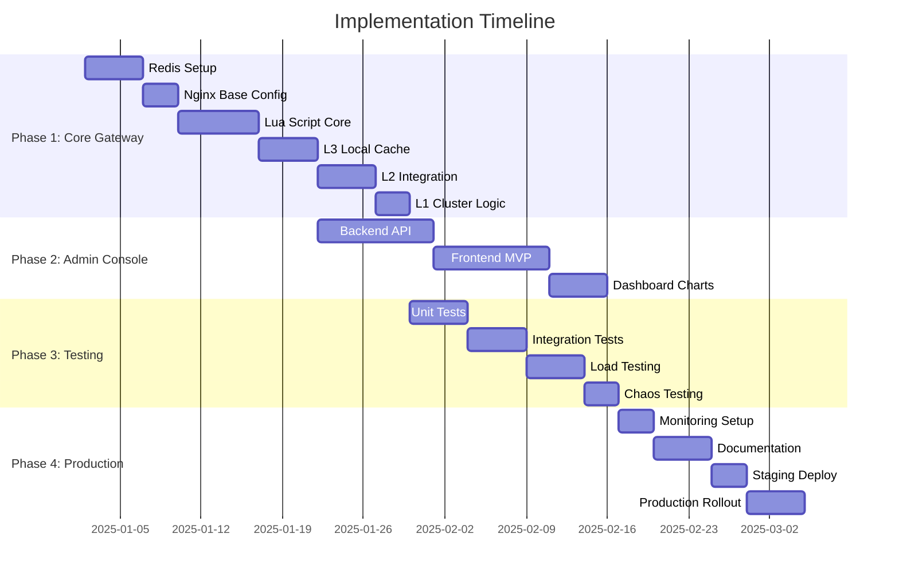
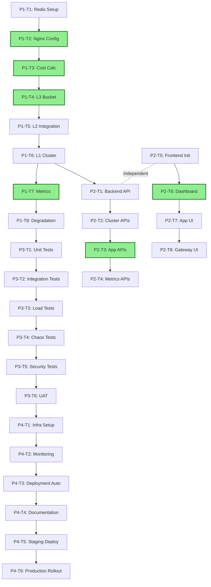

# OpenResty 分布式限流系统 - 实施路线图

**Document Version**: 1.0
**Date**: 2025-12-31
**System**: Distributed Three-Layer Token Bucket Rate Limiter

---

## Table of Contents

1. [Executive Summary](#1-executive-summary)
2. [Visual Roadmap](#2-visual-roadmap)
3. [Phase 1: Core Gateway Implementation](#3-phase-1-core-gateway-implementation)
4. [Phase 2: Admin Console MVP](#4-phase-2-admin-console-mvp)
5. [Phase 3: Testing and Quality Assurance](#5-phase-3-testing-and-quality-assurance)
6. [Phase 4: Production Deployment Preparation](#6-phase-4-production-deployment-preparation)
7. [Quick Wins](#7-quick-wins)
8. [Task Dependency Graph](#8-task-dependency-graph)
9. [Risk Assessment and Mitigation](#9-risk-assessment-and-mitigation)
10. [Resource Planning](#10-resource-planning)

---

## 1. Executive Summary

### 1.1 Project Overview

This roadmap implements a **distributed three-layer token bucket rate limiting system** using OpenResty (Nginx + LuaJIT) and Redis Cluster. The system provides:

- **L1 Cluster Layer**: Physical resource protection with global quota management
- **L2 Application Layer**: Multi-tenant isolation with guaranteed and burst quotas
- **L3 Local Layer**: Edge caching for <1ms response time (95%+ cache hit rate)

### 1.2 Key Innovations

- **Cost Normalization**: Unified metric for IOPS and bandwidth constraints
- **Three-Layer Architecture**: Balances performance, scalability, and reliability
- **Graceful Degradation**: Three-level fallback strategy for Redis failures
- **Elastic Borrowing**: Temporary quota borrowing with interest mechanism

### 1.3 Performance Targets

| Metric | Target |
|--------|--------|
| P99 Latency | < 10ms |
| L3 Cache Hit Rate | > 95% |
| Throughput | 50k+ TPS per gateway |
| Availability | 99.99% |
| Redis Call Reduction | 100-1000× via batching |

---

## 2. Visual Roadmap



---

## 3. Phase 1: Core Gateway Implementation

**Duration**: 4 weeks
**Team**: 2-3 backend engineers
**Goal**: Deploy functional gateway with three-layer rate limiting

### 3.1 Task Breakdown

#### P1-T1: Redis Cluster Setup (Week 1, Days 1-5)
**Complexity**: Medium
**Dependencies**: None

**Deliverables**:
- Deploy Redis Cluster (3 master + 3 replica nodes)
- Configure persistence (AOF + RDB)
- Setup monitoring and alerting
- Document deployment procedure

**Verification Criteria**:
- [ ] Cluster accepts connections from test client
- [ ] Failover works when master node goes down
- [ ] Data persists across restarts
- [ ] P99 latency < 5ms for GET/SET operations

**Files**:
```
infrastructure/
├── docker/
│   ├── redis-cluster.yml
│   └── redis sentinel.yml
├── ansible/
│   └── redis-deploy.yml
└── monitoring/
    └── redis-exporter-config.yml
```

**Risk**: Redis cluster quorum loss during network partition
**Mitigation**: Deploy across 3 availability zones with anti-affinity

---

#### P1-T2: Nginx Base Configuration (Week 1, Days 6-8)
**Complexity**: Low
**Dependencies**: P1-T1

**Deliverables**:
- Install OpenResty with required modules
- Configure nginx.conf with basic rate limiting hooks
- Setup shared memory zones (100MB for token cache)
- Configure upstream for storage backend

**Verification Criteria**:
- [ ] OpenResty starts without errors
- [ ] Shared memory zones are created
- [ ] Test endpoint returns 200 OK
- [ ] Logs show request processing

**Files**:
```
config/
├── nginx.conf
├── mime.types
└── conf.d/
    ├── upstream.conf
    └── rate-limit.conf
```

**Quick Win**: Basic reverse proxy working in 1 day

---

#### P1-T3: Core Lua Scripts - Cost Calculation (Week 2, Days 1-3)
**Complexity**: Low
**Dependencies**: P1-T2

**Deliverables**:
- Implement `cost.lua` with Cost formula: `C_base + (Size / Unit_quantum) × C_bw`
- Add support for different HTTP methods
- Unit tests for edge cases

**Verification Criteria**:
- [ ] GET request (1KB) = C_base cost
- [ ] PUT request (64KB) = C_base + 1 × C_bw
- [ ] POST request (1MB) = C_base + 16 × C_bw
- [ ] Handles 0-byte requests correctly

**Files**:
```
lua/ratelimit/
├── init.lua
├── cost.lua
└── cost_test.lua
```

**Code Example**:
```lua
-- lua/ratelimit/cost.lua
local _M = {
    C_base = 2,           -- IOPS overhead
    C_bw = 1,             -- Bandwidth coefficient
    Unit_quantum = 65536  -- 64KB
}

function _M.calculate(method, content_length)
    local base_cost = _M.C_base

    if method == "GET" or method == "HEAD" then
        return base_cost
    end

    local size = tonumber(content_length) or 0
    local bw_cost = math.ceil(size / _M.Unit_quantum) * _M.C_bw

    return base_cost + bw_cost
end

return _M
```

---

#### P1-T4: L3 Local Token Bucket (Week 2, Days 4-6)
**Complexity**: Medium
**Dependencies**: P1-T3

**Deliverables**:
- Implement `l3_bucket.lua` with local cache
- Async token refill logic
- Batch synchronization to L2
- Fail-open mechanism for Redis failures

**Verification Criteria**:
- [ ] 95%+ requests hit local cache (<1ms)
- [ ] Cache refills when below 20% threshold
- [ ] Batching triggers at 1000 operations or 100ms
- [ ] Fail-open activates when Redis unavailable

**Files**:
```
lua/ratelimit/
├── l3_bucket.lua
└── l3_bucket_test.lua
```

**Quick Win**: Local caching reduces Redis calls by 100×

---

#### P1-T5: L2 Application Layer Integration (Week 2, Days 7-9)
**Complexity**: Medium
**Dependencies**: P1-T4

**Deliverables**:
- Redis Lua scripts for atomic token operations
- Token refill logic (leaky bucket)
- Burst quota management
- Borrowing mechanism

**Verification Criteria**:
- [ ] Tokens refill at guaranteed rate
- [ ] Burst quota allows temporary exceedance
- [ ] Borrowing works when burst exhausted
- [ ] All operations are atomic (verified via concurrent tests)

**Files**:
```
redis_scripts/
├── acquire_tokens.lua
├── batch_acquire.lua
├── borrow_tokens.lua
└── repay_tokens.lua
```

---

#### P1-T6: L1 Cluster Logic (Week 3, Days 1-3)
**Complexity**: Medium
**Dependencies**: P1-T5

**Deliverables**:
- Cluster-level quota enforcement
- Emergency mode activation
- Priority-based throttling
- Global reconciliation

**Verification Criteria**:
- [ ] Cluster capacity never exceeded
- [ ] Emergency mode triggers at 95% usage
- [ ] High-priority apps get preferential treatment
- [ ] Reconciliation corrects drift within 10%

**Files**:
```
redis_scripts/
├── cluster_deduct.lua
├── emergency_activate.lua
└── global_reconcile.lua
```

---

#### P1-T7: Metrics Collection (Week 3, Days 4-5)
**Complexity**: Low
**Dependencies**: P1-T6

**Deliverables**:
- Prometheus metrics exporter
- Request/rejection counters
- Latency histograms
- Token state gauges

**Verification Criteria**:
- [ ] `/metrics` endpoint returns Prometheus format
- [ ] All metrics include required labels (app_id, method, etc.)
- [ ] Metrics update in real-time
- [ ] Prometheus successfully scrapes metrics

**Files**:
```
lua/ratelimit/
├── metrics.lua
└── prometheus.lua
```

---

#### P1-T8: Degradation Strategy (Week 3, Days 6-7)
**Complexity**: Medium
**Dependencies**: P1-T7

**Deliverables**:
- Three-level degradation implementation
- Automatic mode switching based on Redis health
- Manual override endpoints
- Degradation metrics

**Verification Criteria**:
- [ ] Level 1 triggers at Redis latency >10ms
- [ ] Level 2 triggers at Redis latency >100ms or error rate ≥5%
- [ ] Level 3 triggers at Redis timeout or error rate >50%
- [ ] Manual override works via admin API

**Files**:
```
lua/ratelimit/
├── degradation.lua
└── health_check.lua
```

---

### 3.2 Phase 1 Summary

**Total Duration**: 3 weeks
**Total Tasks**: 8
**Quick Wins**: 3 (Nginx setup, Cost calculation, L3 caching)

**Key Deliverables**:
- Functional rate limiting gateway
- Three-layer token bucket implementation
- Graceful degradation mechanism
- Prometheus metrics export

**Success Metrics**:
- Gateway processes 10k+ TPS in tests
- P99 latency < 10ms for rate limit checks
- 95%+ cache hit rate for L3
- Zero data loss during Redis failover

---

## 4. Phase 2: Admin Console MVP

**Duration**: 3 weeks
**Team**: 1 backend + 1 frontend engineer
**Goal**: Provide interface for quota management and monitoring

### 4.1 Task Breakdown

#### P2-T1: Backend API Foundation (Week 1, Days 1-5)
**Complexity**: Medium
**Dependencies**: P1-T6 (L2 integration)

**Deliverables**:
- RESTful API server (Go + Gin framework)
- PostgreSQL schema for applications, events
- JWT authentication middleware
- Request validation and error handling

**Verification Criteria**:
- [ ] API server starts on port 8080
- [ ] JWT authentication works
- [ ] CRUD operations for applications
- [ ] API returns JSON responses with proper status codes

**Files**:
```
backend/
├── main.go
├── api/
│   ├── handlers.go
│   ├── middleware.go
│   └── routes.go
├── models/
│   ├── application.go
│   └── event.go
└── db/
    └── migrations/
        └── 001_initial.up.sql
```

**Database Schema**:
```sql
CREATE TABLE applications (
    app_id VARCHAR(255) PRIMARY KEY,
    guaranteed_quota INTEGER NOT NULL,
    burst_quota INTEGER NOT NULL,
    priority INTEGER DEFAULT 2,
    max_borrow INTEGER DEFAULT 0,
    cost_profile VARCHAR(50) DEFAULT 'standard',
    created_at TIMESTAMP DEFAULT NOW(),
    updated_at TIMESTAMP DEFAULT NOW()
);

CREATE TABLE events (
    id SERIAL PRIMARY KEY,
    event_type VARCHAR(100) NOT NULL,
    app_id VARCHAR(255),
    message TEXT,
    details JSONB,
    created_at TIMESTAMP DEFAULT NOW()
);
```

---

#### P2-T2: Cluster Management APIs (Week 1, Days 6-8)
**Complexity**: Medium
**Dependencies**: P2-T1

**Deliverables**:
- `GET /api/v1/clusters` - List all clusters
- `GET /api/v1/clusters/:id` - Cluster details
- `PUT /api/v1/clusters/:id` - Update cluster config
- `POST /api/v1/clusters/:id/emergency` - Emergency mode control

**Verification Criteria**:
- [ ] Can view cluster capacity and usage
- [ ] Can update cluster configuration
- [ ] Emergency mode activation works
- [ ] API documentation complete with OpenAPI spec

**Endpoints**:
```bash
# Get cluster status
curl -X GET http://localhost:8080/api/v1/clusters/cluster-01 \
  -H "Authorization: Bearer $TOKEN"

# Update cluster capacity
curl -X PUT http://localhost:8080/api/v1/clusters/cluster-01 \
  -H "Authorization: Bearer $TOKEN" \
  -H "Content-Type: application/json" \
  -d '{"capacity": 1000000, "reserved_ratio": 0.1}'

# Activate emergency mode
curl -X POST http://localhost:8080/api/v1/clusters/cluster-01/emergency \
  -H "Authorization: Bearer $TOKEN" \
  -H "Content-Type: application/json" \
  -d '{"enable": true, "reason": "Cluster at 96%", "operator": "sre-team"}'
```

---

#### P2-T3: Application Management APIs (Week 2, Days 1-3)
**Complexity**: Medium
**Dependencies**: P2-T2

**Deliverables**:
- `POST /api/v1/apps` - Create application
- `GET /api/v1/apps` - List applications
- `GET /api/v1/apps/:id` - Application details
- `PUT /api/v1/apps/:id` - Update application
- `DELETE /api/v1/apps/:id` - Delete application
- `PATCH /api/v1/apps/:id/quota` - Quick quota adjustment
- `POST /api/v1/apps/:id/borrow` - Borrow tokens
- `POST /api/v1/apps/:id/repay` - Repay tokens

**Verification Criteria**:
- [ ] Can create, read, update, delete applications
- [ ] Quota adjustments take effect immediately
- [ ] Borrowing respects max_borrow limit
- [ ] Repayment reduces debt correctly

**Quick Win**: Basic CRUD works in 2 days

---

#### P2-T4: Metrics and Monitoring APIs (Week 2, Days 4-6)
**Complexity**: Medium
**Dependencies**: P2-T3

**Deliverables**:
- `GET /api/v1/metrics/realtime` - Real-time metrics
- `GET /api/v1/metrics/history` - Historical metrics (from Prometheus)
- `GET /api/v1/events` - Event log
- WebSocket support for live updates

**Verification Criteria**:
- [ ] Real-time metrics return current token counts
- [ ] Historical data queries Prometheus via PromQL
- [ ] WebSocket pushes updates within 1 second
- [ ] Events paginated correctly

---

#### P2-T5: Frontend Foundation (Week 2, Days 7-9)
**Complexity**: Low
**Dependencies**: None (can run in parallel with backend)

**Deliverables**:
- Vue 3 + TypeScript project setup
- Pinia state management
- Element Plus UI components
- Axios for API calls
- Router setup

**Verification Criteria**:
- [ ] Project builds without errors
- [ ] Development server runs on port 3000
- [ ] Can navigate between pages
- [ ] API calls work with authentication

**Files**:
```
frontend/
├── package.json
├── vite.config.ts
├── src/
│   ├── main.ts
│   ├── App.vue
│   ├── router/
│   ├── stores/
│   ├── api/
│   └── components/
```

---

#### P2-T6: Dashboard and Overview Page (Week 3, Days 1-3)
**Complexity**: Medium
**Dependencies**: P2-T5

**Deliverables**:
- System health score card
- Total QPS and rejection rate
- L1/L2/L3 usage gauges
- Emergency mode indicator
- Top applications by usage

**Verification Criteria**:
- [ ] Health score calculates correctly
- [ ] Gauges update every 15 seconds
- [ ] Charts render without errors
- [ ] Responsive design works on mobile

**Components**:
```vue
<template>
  <div class="dashboard">
    <el-row :gutter="20">
      <el-col :span="6">
        <HealthScoreCard :score="healthScore" />
      </el-col>
      <el-col :span="6">
        <QPSCard :qps="totalQPS" />
      </el-col>
      <el-col :span="6">
        <RejectionRateCard :rate="rejectionRate" />
      </el-col>
      <el-col :span="6">
        <EmergencyModeIndicator :active="emergencyMode" />
      </el-col>
    </el-row>
    <el-row :gutter="20" style="margin-top: 20px">
      <el-col :span="12">
        <RequestRateChart :data="requestRateData" />
      </el-col>
      <el-col :span="12">
        <RejectionRateChart :data="rejectionRateData" />
      </el-col>
    </el-row>
  </div>
</template>
```

---

#### P2-T7: Application Management UI (Week 3, Days 4-6)
**Complexity**: Medium
**Dependencies**: P2-T6

**Deliverables**:
- Application list with search/filter
- Application creation form
- Application detail view
- Quota adjustment slider
- Borrow/repay dialogs

**Verification Criteria**:
- [ ] List paginates correctly
- [ ] Search filters by app_id
- [ ] Form validation prevents invalid inputs
- [ ] Quota changes confirm via dialog

**Quick Win**: List view with basic actions in 2 days

---

#### P2-T8: Gateway Status Page (Week 3, Days 7-8)
**Complexity**: Low
**Dependencies**: P2-T7

**Deliverables**:
- Gateway instance grid
- Node status (healthy/degraded/fail-open)
- Cache hit rate per node
- Degradation level controls

**Verification Criteria**:
- [ ] Grid displays all gateway nodes
- [ ] Status indicators color-coded
- [ ] Manual degradation controls work
- [ ] Page auto-refreshes every 30 seconds

---

### 4.2 Phase 2 Summary

**Total Duration**: 3 weeks
**Total Tasks**: 8
**Quick Wins**: 2 (Backend CRUD, Frontend setup)

**Key Deliverables**:
- RESTful API with OpenAPI documentation
- Vue 3 admin console
- Real-time dashboard with ECharts
- Application and cluster management interfaces

**Success Metrics**:
- API responds to 1000+ requests/second
- Dashboard loads in <2 seconds
- All CRUD operations work without errors
- WebSocket connections stay stable

---

## 5. Phase 3: Testing and Quality Assurance

**Duration**: 2-3 weeks
**Team**: 2 QA engineers + developers
**Goal**: Ensure system reliability and performance

### 5.1 Task Breakdown

#### P3-T1: Unit Testing (Week 1, Days 1-3)
**Complexity**: Low
**Dependencies**: P1-T8 (Core gateway complete)

**Deliverables**:
- Lua unit tests using busted framework
- Go unit tests for backend API
- Vue component tests using vitest
- Test coverage report

**Verification Criteria**:
- [ ] All Lua modules have >80% coverage
- [ ] All Go handlers have >80% coverage
- [ ] Critical components have >90% coverage
- [ ] Tests run in CI/CD pipeline

**Files**:
```
tests/
├── unit/
│   ├── lua/
│   │   ├── cost_test.lua
│   │   ├── l3_bucket_test.lua
│   │   └── metrics_test.lua
│   ├── go/
│   │   ├── handlers_test.go
│   │   └── models_test.go
│   └── vue/
│       └── components_test.ts
└── coverage/
    └── .coverage.json
```

**Test Example**:
```lua
-- tests/unit/lua/cost_test.lua
describe("Cost calculation", function()
  it("should calculate cost for GET request", function()
    local cost = require("ratelimit.cost")
    assert.equal(2, cost.calculate("GET", 0))
  end)

  it("should calculate cost for PUT request with 64KB", function()
    local cost = require("ratelimit.cost")
    assert.equal(3, cost.calculate("PUT", 65536))  -- 2 + 1
  end)

  it("should calculate cost for POST request with 1MB", function()
    local cost = require("ratelimit.cost")
    assert.equal(18, cost.calculate("POST", 1048576))  -- 2 + 16
  end)
end)
```

---

#### P3-T2: Integration Testing (Week 1, Days 4-6)
**Complexity**: Medium
**Dependencies**: P3-T1

**Deliverables**:
- End-to-end request flow tests
- Redis integration tests
- API integration tests
- Docker compose test environment

**Verification Criteria**:
- [ ] Request flows through all three layers
- [ ] Redis failover works correctly
- [ ] API endpoints integrate with gateway
- [ ] Tests can run locally and in CI

**Test Scenarios**:
```yaml
test_scenarios:
  - name: "Happy path - request allowed"
    steps:
      - Send request with valid app_id
      - Verify L3 cache hit
      - Verify response 200 OK

  - name: "Quota exhausted - request rejected"
    steps:
      - Exhaust application quota
      - Send request
      - Verify response 429
      - Verify Retry-After header

  - name: "Redis failure - fail-open"
    steps:
      - Stop Redis container
      - Send request
      - Verify fail-open mode activates
      - Verify request allowed with local quota

  - name: "Emergency mode - priority throttling"
    steps:
      - Activate emergency mode
      - Send requests from P0, P1, P2 apps
      - Verify P0 allowed, P1 partially allowed, P2 rejected
```

---

#### P3-T3: Load Testing (Week 2, Days 1-4)
**Complexity**: Medium
**Dependencies**: P3-T2

**Deliverables**:
- Performance test suite using k6 or Locust
- Baseline performance metrics
- Breakpoint identification
- Performance optimization recommendations

**Verification Criteria**:
- [ ] System handles 50k TPS per gateway
- [ ] P99 latency < 10ms at 50k TPS
- [ ] L3 cache hit rate > 95%
- [ ] No memory leaks during sustained load

**Load Test Scenarios**:
```javascript
// tests/load/k6/basic-load.js
import http from 'k6/http';
import { check, sleep } from 'k6';

export let options = {
  stages: [
    { duration: '2m', target: 10000 },  // Ramp up to 10k
    { duration: '5m', target: 10000 },  // Stay at 10k
    { duration: '2m', target: 50000 },  // Ramp up to 50k
    { duration: '5m', target: 50000 },  // Stay at 50k
    { duration: '2m', target: 0 },      // Ramp down
  ],
  thresholds: {
    http_req_duration: ['p(99)<10000'],  // P99 < 10s (includes upstream)
    http_req_failed: ['rate<0.05'],      // Error rate < 5%
  },
};

export default function() {
  let res = http.post(
    'http://nginx-gateway/api/v1/test',
    JSON.stringify({ data: 'test'.repeat(1000) }),
    {
      headers: {
        'Content-Type': 'application/json',
        'X-App-Id': 'load-test-app',
        'X-User-Id': `user-${__VU}`,
      },
    }
  );

  check(res, {
    'status is 200 or 429': (r) => r.status === 200 || r.status === 429,
  });

  sleep(1);
}
```

---

#### P3-T4: Chaos Engineering (Week 2, Days 5-7)
**Complexity**: High
**Dependencies**: P3-T3

**Deliverables**:
- Chaos test scenarios using Chaos Mesh or similar
- Fault injection procedures
- Recovery validation
- Chaos engineering report

**Verification Criteria**:
- [ ] System survives Redis master failure
- [ ] System survives network partition
- [ ] System survives 50% gateway node loss
- [ ] Recovery completes within 30 seconds

**Chaos Scenarios**:
```yaml
chaos_scenarios:
  - name: "Redis master failure"
    action: "Terminate Redis master pod"
    expected: "Failover to replica within 10s"
    verification: "No 5xx errors, fail-open activates if needed"

  - name: "Network partition"
    action: "Block network between gateway and Redis"
    expected: "Fail-open mode activates"
    verification: "Requests served with local quota"

  - name: "Gateway node crash"
    action: "Terminate 50% of gateway pods"
    expected: "Traffic shifts to remaining nodes"
    verification: "No increase in error rate"

  - name: "Redis CPU exhaustion"
    action: "Run stress test on Redis"
    expected: "Degradation level adjusts"
    verification: "L3 cache hit rate increases"
```

---

#### P3-T5: Security Testing (Week 3, Days 1-2)
**Complexity**: Medium
**Dependencies**: P3-T4

**Deliverables**:
- Authentication/authorization tests
- Input validation tests
- Rate limiting bypass tests
- Security scan report

**Verification Criteria**:
- [ ] Unauthorized requests rejected with 401
- [ ] SQL injection attempts blocked
- [ ] XSS attacks prevented
- [ ] Cost manipulation detected

**Security Test Cases**:
```bash
# Test 1: Missing authentication
curl -X GET http://localhost:8080/api/v1/apps
# Expected: 401 Unauthorized

# Test 2: SQL injection
curl -X POST http://localhost:8080/api/v1/apps \
  -H "Content-Type: application/json" \
  -d '{"app_id": "test'; DROP TABLE applications; --"}'
# Expected: 400 Bad Request

# Test 3: Cost manipulation
curl -X POST http://nginx-gateway/api/v1/test \
  -H "X-App-Id: test-app" \
  -H "X-Reported-Cost: 0"
# Expected: Actual cost used, reported header ignored

# Test 4: Token exhaustion attack
for i in {1..10000}; do
  curl -X POST http://nginx-gateway/api/v1/test \
    -H "X-App-Id: attacker" &
done
# Expected: Attacker throttled, other apps unaffected
```

---

#### P3-T6: User Acceptance Testing (Week 3, Days 3-5)
**Complexity**: Low
**Dependencies**: All previous tasks

**Deliverables**:
- UAT test plan
- Test scenarios for real users
- Feedback collection
- Issue tracking

**Verification Criteria**:
- [ ] 5+ SRE engineers complete UAT
- [ ] 90%+ test scenarios pass
- [ ] Critical bugs fixed before production
- [ ] Documentation reviewed and approved

**UAT Scenarios**:
```markdown
## UAT Scenario 1: Create Application and Set Quota
**User**: SRE Engineer
**Steps**:
1. Login to admin console
2. Navigate to Applications page
3. Click "Create Application"
4. Fill form: app_id="uat-app", guaranteed_quota=10000, burst_quota=50000
5. Submit form
6. Verify app appears in list
7. Click on app to view details
8. Verify quota settings displayed correctly

**Expected Result**: Application created successfully, quota visible in dashboard

---

## UAT Scenario 2: Activate Emergency Mode
**User**: SRE On-call
**Steps**:
1. Monitor dashboard shows cluster usage at 96%
2. Navigate to Cluster Management page
3. Click "Emergency Mode" button
4. Fill reason: "Cluster at 96%, protecting system"
5. Confirm activation
6. Verify emergency banner appears on dashboard
7. Monitor traffic for 5 minutes
8. Verify high-priority apps still allowed

**Expected Result**: Emergency mode activates, low-priority traffic throttled

---

## UAT Scenario 3: Monitor Real-time Metrics
**User**: SRE Engineer
**Steps**:
1. Open dashboard
2. Verify health score displays
3. Check QPS counter updates in real-time
4. View request rate chart
5. Switch to application detail view
6. Verify token bucket gauge updates
7. Check rejection rate breakdown

**Expected Result**: All metrics update within 15 seconds, no stale data
```

---

### 5.2 Phase 3 Summary

**Total Duration**: 2-3 weeks
**Total Tasks**: 6
**Quick Wins**: 1 (Unit tests catch bugs early)

**Key Deliverables**:
- Comprehensive test suite
- Load test report with benchmarks
- Chaos engineering procedures
- Security audit results
- UAT sign-off

**Success Metrics**:
- >80% code coverage
- System handles 50k TPS in tests
- Zero critical bugs after UAT
- Recovery time < 30s from failures

---

## 6. Phase 4: Production Deployment Preparation

**Duration**: 2 weeks
**Team**: SRE + developers
**Goal**: Safe production rollout

### 6.1 Task Breakdown

#### P4-T1: Production Infrastructure Setup (Week 1, Days 1-3)
**Complexity**: Medium
**Dependencies**: P3-T6 (UAT complete)

**Deliverables**:
- Kubernetes production cluster
- Redis Cluster production setup
- TLS certificates
- DNS configuration
- Network policies

**Verification Criteria**:
- [ ] K8s cluster has 3+ nodes
- [ ] Redis deployed across 3 AZs
- [ ] TLS certificates valid
- [ ] DNS resolves to load balancer
- [ ] Network policies allow required traffic

**Infrastructure Diagram**:
```
Internet
    │
    ▼
┌─────────────────────────────────────────────────────────┐
│  Load Balancer (SSL termination)                        │
│  LB: ratelimit.example.com                              │
└─────────────────────────────────────────────────────────┘
    │
    ▼
┌─────────────────────────────────────────────────────────┐
│  Kubernetes Cluster (3 nodes × 8 CPU + 32GB RAM)        │
│                                                          │
│  ┌────────────────────────────────────────────────────┐ │
│  │ Nginx Gateway (3 replicas × 2 CPU + 4GB RAM)       │ │
│  │ HPA: 3-20 replicas                                  │ │
│  └────────────────────────────────────────────────────┘ │
│                                                          │
│  ┌────────────────────────────────────────────────────┐ │
│  │ Admin Console (2 replicas × 1 CPU + 2GB RAM)       │ │
│  └────────────────────────────────────────────────────┘ │
└─────────────────────────────────────────────────────────┘
    │
    ▼
┌─────────────────────────────────────────────────────────┐
│  Redis Cluster (6 nodes: 3 master + 3 replica)          │
│  Each: 4 CPU + 16GB RAM, 100GB SSD                      │
│  Anti-affinity: Across 3 AZs                            │
└─────────────────────────────────────────────────────────┘
    │
    ▼
┌─────────────────────────────────────────────────────────┐
│  Storage Backend (existing service)                     │
└─────────────────────────────────────────────────────────┘
```

---

#### P4-T2: Monitoring and Alerting Setup (Week 1, Days 4-6)
**Complexity**: Medium
**Dependencies**: P4-T1

**Deliverables**:
- Prometheus production deployment
- Grafana dashboards
- AlertManager configuration
- PagerDuty integration
- On-call runbooks

**Verification Criteria**:
- [ ] Prometheus scrapes all targets
- [ ] Grafana displays all dashboards
- [ ] Alerts fire on threshold breach
- [ ] PagerDuty receives notifications
- [ ] On-call runbooks tested

**Critical Alerts**:
```yaml
# AlertManager configuration
alerts:
  - name: EmergencyModeActivated
    severity: critical
    condition: ratelimit_emergency_mode == 1
    action: Page SRE on-call immediately

  - name: HighRejectionRate
    severity: warning
    condition: rejection_rate > 10%
    action: Create ticket, notify team Slack

  - name: RedisDown
    severity: critical
    condition: redis_up == 0
    action: Page DBA + SRE on-call

  - name: GatewayHighLatency
    severity: warning
    condition: P99 latency > 50ms
    action: Investigate and scale if needed

  - name: FailOpenModeActive
    severity: critical
    condition: ratelimit_fail_open_active == 1
    action: Immediate investigation required
```

**Runbook Template**:
```markdown
# Runbook: Emergency Mode Activated

## Severity
Critical - Page SRE on-call

## Symptoms
- Dashboard shows emergency mode active
- Cluster usage > 95%
- Low-priority applications being throttled

## Immediate Actions
1. Check dashboard for cluster usage
2. Verify if this is expected (e.g., planned traffic spike)
3. Check if any application is misbehaving
4. Review Redis performance

## Resolution Steps
1. If expected traffic: No action needed, monitor closely
2. If unexpected traffic:
   a. Identify top-consuming applications
   b. Reduce their quotas temporarily
   c. Consider activating emergency mode manually
3. If Redis issue:
   a. Check Redis metrics
   b. Scale Redis if CPU/memory constrained
   c. Restart slow queries

## Recovery
1. Monitor cluster usage drops below 90%
2. Emergency mode auto-expires after 5 minutes
3. Normal operation resumes
4. Create postmortem if triggered by bug

## Escalation
- If unable to resolve in 15 minutes: Escalate to staff engineer
- If system continues degrading: Engage incident commander
```

---

#### P4-T3: Deployment Automation (Week 1, Days 7-9)
**Complexity**: Medium
**Dependencies**: P4-T2

**Deliverables**:
- Helm charts for all services
- CI/CD pipeline (GitHub Actions / GitLab CI)
- Blue-green deployment strategy
- Rollback procedures

**Verification Criteria**:
- [ ] `helm install` deploys all services
- [ ] CI/CD runs tests on every PR
- [ ] Blue-green deployment switches traffic seamlessly
- [ ] Rollback completes in < 5 minutes

**Helm Chart Structure**:
```
helm/ratelimit/
├── Chart.yaml
├── values.yaml
├── values-prod.yaml
└── templates/
    ├── gateway/
    │   ├── deployment.yaml
    │   ├── service.yaml
    │   ├── hpa.yaml
    │   └── configmap.yaml
    ├── admin/
    │   ├── deployment.yaml
    │   ├── service.yaml
    │   └── ingress.yaml
    ├── redis/
    │   └── statefulset.yaml
    └── monitoring/
        ├── servicemonitor.yaml
        └── prometheusrule.yaml
```

**Deployment Pipeline**:
```yaml
# .github/workflows/deploy.yml
name: Deploy to Production

on:
  push:
    branches: [main]

jobs:
  test:
    runs-on: ubuntu-latest
    steps:
      - uses: actions/checkout@v3
      - name: Run unit tests
        run: make test-unit
      - name: Run integration tests
        run: make test-integration

  build:
    needs: test
    runs-on: ubuntu-latest
    steps:
      - uses: actions/checkout@v3
      - name: Build Docker images
        run: |
          docker build -t ratelimit-gateway:${{ github.sha }} .
          docker build -t ratelimit-admin:${{ github.sha }} ./admin
      - name: Push to registry
        run: |
          docker push ratelimit-gateway:${{ github.sha }}
          docker push ratelimit-admin:${{ github.sha }}

  deploy-staging:
    needs: build
    runs-on: ubuntu-latest
    environment: staging
    steps:
      - name: Deploy to staging
        run: |
          helm upgrade --install ratelimit-staging ./helm/ratelimit \
            --set image.tag=${{ github.sha }} \
            --values helm/ratelimit/values-staging.yaml
      - name: Run smoke tests
        run: make test-smoke

  deploy-production:
    needs: deploy-staging
    runs-on: ubuntu-latest
    environment: production
    steps:
      - name: Deploy to production (blue-green)
        run: |
          # Deploy to green
          helm upgrade --install ratelimit-green ./helm/ratelimit \
            --set image.tag=${{ github.sha }} \
            --values helm/ratelimit/values-prod.yaml
      - name: Switch traffic to green
        run: |
          kubectl patch svc ratelimit-gateway -p '{"spec":{"selector":{"version":"green"}}}'
      - name: Monitor for errors
        run: |
          # Wait 5 minutes, check error rate
          ./scripts/monitor-deployment.sh
      - name: Cleanup blue
        run: |
          helm uninstall ratelimit-blue || true
```

---

#### P4-T4: Documentation (Week 2, Days 1-3)
**Complexity**: Low
**Dependencies**: P4-T3

**Deliverables**:
- Architecture documentation
- Operator manual
- API documentation
- Troubleshooting guide
- Onboarding guide

**Verification Criteria**:
- [ ] Docs published to internal wiki
- [ ] API docs accessible via Swagger UI
- [ ] Runbooks linked from alert descriptions
- [ ] New engineer can onboard in 1 day

**Documentation Structure**:
```markdown
# Documentation Site
docs/
├── README.md (Overview)
├── architecture/
│   ├── system-design.md
│   ├── three-layer-bucket.md
│   └── cost-algorithm.md
├── operations/
│   ├── deployment-guide.md
│   ├── runbooks/
│   │   ├── emergency-mode.md
│   │   ├── redis-failure.md
│   │   └── high-latency.md
│   └── monitoring-guide.md
├── development/
│   ├── setup-dev-environment.md
│   ├── coding-standards.md
│   └── testing-guide.md
├── api/
│   └── openapi.yaml (auto-generated from Go code)
└── faq.md
```

---

#### P4-T5: Staging Deployment (Week 2, Days 4-5)
**Complexity**: Low
**Dependencies**: P4-T4

**Deliverables**:
- Full staging environment
- Smoke tests pass
- Performance baseline recorded
- User acceptance complete

**Verification Criteria**:
- [ ] All services deployed and healthy
- [ ] Smoke tests pass 100%
- [ ] Load test meets performance targets
- [ ] 5+ users validate functionality

**Smoke Test Suite**:
```bash
#!/bin/bash
# tests/smoke/smoke.sh

set -e

GATEWAY_URL="https://ratelimit-staging.example.com"
ADMIN_URL="https://ratelimit-admin-staging.example.com"
TOKEN=$(get-auth-token)

echo "Testing health endpoint..."
curl -f ${GATEWAY_URL}/health || exit 1

echo "Testing metrics endpoint..."
curl -f ${GATEWAY_URL}/metrics || exit 1

echo "Testing rate limiting..."
curl -f -X POST ${GATEWAY_URL}/api/v1/test \
  -H "X-App-Id: smoke-test" \
  -H "X-User-Id: test-user" || exit 1

echo "Testing admin API..."
curl -f ${ADMIN_URL}/api/v1/apps \
  -H "Authorization: Bearer ${TOKEN}" || exit 1

echo "Checking Prometheus targets..."
curl -f http://prometheus-staging:9090/api/v1/targets || exit 1

echo "All smoke tests passed!"
```

---

#### P4-T6: Production Rollout (Week 2, Days 6-10)
**Complexity**: High
**Dependencies**: P4-T5

**Deliverables**:
- Canary deployment (5% → 25% → 50% → 100%)
- Real production metrics
- Incident monitoring
- Post-deployment review

**Verification Criteria**:
- [ ] Canary phases complete without rollback
- [ ] Error rate remains below 1%
- [ ] P99 latency < 15ms (allows for network)
- [ ] No critical incidents during rollout

**Canary Strategy**:
```yaml
canary_phases:
  - phase: 1
    name: "Canary 5%"
    duration: "2 hours"
    traffic: 5%
    success_criteria:
      error_rate: < 0.5%
      p99_latency: < 15ms
      rejection_rate: < 5%

  - phase: 2
    name: "Canary 25%"
    duration: "4 hours"
    traffic: 25%
    success_criteria:
      error_rate: < 1%
      p99_latency: < 15ms

  - phase: 3
    name: "Canary 50%"
    duration: "1 day"
    traffic: 50%
    success_criteria:
      error_rate: < 1%
      p99_latency: < 15ms

  - phase: 4
    name: "Full Rollout"
    duration: "1 hour"
    traffic: 100%
    success_criteria:
      error_rate: < 1%
      p99_latency: < 15ms

rollback_triggers:
  - error_rate > 5%
  - p99_latency > 50ms
  - emergency_mode activates
  - redis_errors > 1%
```

**Rollback Procedure**:
```bash
#!/bin/bash
# scripts/rollback.sh

echo "Executing emergency rollback..."

# Switch traffic back to old version
kubectl patch svc ratelimit-gateway \
  -p '{"spec":{"selector":{"version":"blue"}}}'

# Wait for traffic to shift
sleep 30

# Verify health
for i in {1..10}; do
  if curl -f https://ratelimit.example.com/health; then
    echo "Rollback successful!"
    exit 0
  fi
  sleep 5
done

echo "Rollback failed - manual intervention required!"
exit 1
```

---

### 6.2 Phase 4 Summary

**Total Duration**: 2 weeks
**Total Tasks**: 6
**Quick Wins**: 1 (Documentation improves onboarding)

**Key Deliverables**:
- Production infrastructure
- Monitoring and alerting
- CI/CD automation
- Complete documentation
- Successful production rollout

**Success Metrics**:
- Zero-downtime deployment
- All canary phases pass
- P99 latency < 15ms in production
- Rollback tested and ready

---

## 7. Quick Wins

These tasks deliver value early and can be completed independently:

### QW1: Basic Nginx Reverse Proxy (Day 2)
**Value**: Immediate request routing capability
**Effort**: 4 hours
**Impact**: Team can start testing upstream integration

### QW2: Cost Calculation Module (Day 5)
**Value**: Core rate limiting logic
**Effort**: 1 day
**Impact**: Business logic validated early

### QW3: L3 Local Caching (Day 12)
**Value**: 100× reduction in Redis calls
**Effort**: 2 days
**Impact**: Significant performance improvement visible

### QW4: Admin API CRUD (Day 20)
**Value**: Manual quota management possible
**Effort**: 2 days
**Impact**: Operations team can start using system

### QW5: Prometheus Metrics (Day 18)
**Value**: Visibility into system behavior
**Effort**: 1 day
**Impact**: Debugging becomes easier

### QW6: Basic Dashboard (Day 28)
**Value**: Visual monitoring
**Effort**: 2 days
**Impact**: Stakeholders see progress

---

## 8. Task Dependency Graph



---

## 9. Risk Assessment and Mitigation

### 9.1 High Priority Risks

| Risk | Probability | Impact | Mitigation Strategy | Owner |
|------|------------|--------|-------------------|-------|
| **Redis Cluster Failure** | Medium | High | 3-level degradation, fail-open mode, multi-AZ deployment | SRE |
| **Performance Doesn't Meet Target** | Medium | High | Early load testing, optimization iterations, horizontal scaling | Performance Team |
| **L3/L2 Token Drift** | High | Medium | Reconciliation scripts, periodic audits, drift alerts | Backend |
| **Cost Manipulation Attacks** | Low | High | Input validation, actual cost verification, anomaly detection | Security |
| **Deployment Causes Outage** | Low | High | Blue-green deployment, canary rollout, automated rollback | SRE |
| **Team Knowledge Gap** | Medium | Medium | Documentation, pair programming, training sessions | Tech Lead |

### 9.2 Risk Response Plans

#### Risk 1: Redis Cluster Failure
**Trigger**: Redis unreachable for >30 seconds
**Detection**: Alert from Prometheus
**Response**:
1. Immediate: Fail-open mode activates automatically
2. Short-term: Redis team investigates, scales if needed
3. Long-term: Consider Redis Enterprise or managed service

#### Risk 2: Performance Below Target
**Trigger**: P99 latency > 10ms or TPS < 50k
**Detection**: Load test metrics
**Response**:
1. Profile Lua scripts for bottlenecks
2. Optimize Redis Lua scripts
3. Increase L3 cache size
4. Add more gateway nodes (horizontal scaling)

#### Risk 3: Token Drift Between L3 and L2
**Trigger**: Drift > 10% detected in reconciliation
**Detection**: Reconciliation alerts
**Response**:
1. Verify batch sync logic
2. Check Redis Lua script atomicity
3. Increase sync frequency
4. Add compensation transactions

---

## 10. Resource Planning

### 10.1 Team Composition

**Core Team** (Full-time):
- 2 Backend Engineers (Lua/Go)
- 1 Frontend Engineer (Vue.js)
- 1 SRE Engineer (Kubernetes/Redis)
- 1 QA Engineer
- 1 Tech Lead (Architecture + Code Review)

**Part-time**:
- 1 Security Engineer (Weeks 2-3)
- 1 Performance Engineer (Week 3)
- 1 Product Manager (Requirements + UAT)

### 10.2 Infrastructure Resources

**Development**:
- 1 Kubernetes cluster (3 nodes)
- 1 Redis instance (single node for dev)
- Shared development environment

**Staging**:
- 1 Kubernetes cluster (3 nodes × 8 CPU + 32GB RAM)
- 1 Redis Cluster (3 nodes)
- Load testing tools (k6/Locust)

**Production**:
- 1 Kubernetes cluster (9 nodes × 16 CPU + 64GB RAM)
- 1 Redis Cluster (6 nodes: 3 master + 3 replica)
- 3 Availability Zones
- Managed monitoring (Prometheus/Grafana)

### 10.3 Budget Estimate

| Category | Item | Monthly Cost | Notes |
|----------|------|-------------|-------|
| Compute | K8s Nodes (9 × $400) | $3,600 | 16 CPU, 64GB RAM |
| Compute | Gateway HPA (up to 20 pods) | $800 | Auto-scaling |
| Database | Redis Cluster (6 nodes) | $1,200 | Managed Redis |
| Storage | SSD (100GB × 6) | $300 | For Redis |
| Network | Load Balancer | $200 | SSL termination |
| Monitoring | Prometheus + Grafana | $500 | Managed service |
| **Total** | | **$6,600/month** | Production only |

**One-time Costs**:
- Development tools: $2,000
- Training: $3,000
- Security audit: $5,000
- Performance testing: $2,000
- **Total**: $12,000

---

## 11. Success Metrics

### 11.1 Technical Metrics

| Metric | Target | How to Measure |
|--------|--------|---------------|
| P99 Latency | < 10ms | Prometheus histogram |
| L3 Cache Hit Rate | > 95% | Redis call counter |
| Throughput | > 50k TPS | Load test results |
| Availability | > 99.99% | Uptime monitoring |
| Redis Call Reduction | > 100× | Redis command counter |

### 11.2 Business Metrics

| Metric | Target | How to Measure |
|--------|--------|---------------|
| Time to Deploy | < 1 day | CI/CD logs |
| Onboarding Time | < 1 day | New developer survey |
| Incident Response Time | < 15 min | Alert timestamps |
| Developer Satisfaction | > 4/5 | Quarterly survey |

### 11.3 Quality Metrics

| Metric | Target | How to Measure |
|--------|--------|---------------|
| Code Coverage | > 80% | Test coverage report |
| Critical Bugs | 0 in production | Issue tracker |
| Documentation Completeness | 100% | Documentation checklist |
| UAT Pass Rate | > 90% | UAT results |

---

## 12. Timeline Summary

| Phase | Duration | Start | End | Key Deliverable |
|-------|----------|-------|-----|----------------|
| Phase 1: Core Gateway | 3 weeks | Week 1 | Week 3 | Functional rate limiting |
| Phase 2: Admin Console | 3 weeks | Week 2 | Week 5 | Management UI |
| Phase 3: Testing | 2-3 weeks | Week 4 | Week 7 | Test sign-off |
| Phase 4: Production | 2 weeks | Week 7 | Week 9 | Live system |

**Total Duration**: 9 weeks (2.25 months)

**Critical Path**:
```
Redis Setup → Nginx Config → Cost Calc → L3 Bucket → L2 Integration →
L1 Cluster → Unit Tests → Integration Tests → Load Tests →
UAT → Production Rollout
```

**Parallel Work**:
- Admin backend API (Week 2-4)
- Admin frontend (Week 3-5)
- Documentation (Week 8)

---

## 13. Next Steps

### Immediate Actions (This Week)

1. **Kickoff Meeting** (Day 1)
   - Review roadmap with team
   - Assign tasks to owners
   - Setup communication channels

2. **Infrastructure Setup** (Day 2-3)
   - Create development Kubernetes cluster
   - Deploy Redis for development
   - Setup shared environments

3. **Development Environment** (Day 3-5)
   - Clone repository
   - Setup local development tools
   - Complete onboarding checklist

4. **First Sprint** (Week 1)
   - Start P1-T1: Redis Setup
   - Start P2-T5: Frontend Init (in parallel)
   - Daily standups at 9 AM

### Tracking

Use the following tools for progress tracking:

- **Project Management**: Jira / Linear
- **Code Review**: GitHub / GitLab
- **CI/CD**: GitHub Actions / GitLab CI
- **Documentation**: Confluence / Notion
- **Monitoring**: Grafana dashboards

---

## Appendix A: Task Checklist for TodoWrite

```yaml
# Phase 1 Tasks
- [P1-T1] Redis Cluster Setup
- [P1-T2] Nginx Base Configuration
- [P1-T3] Core Lua Scripts - Cost Calculation
- [P1-T4] L3 Local Token Bucket
- [P1-T5] L2 Application Layer Integration
- [P1-T6] L1 Cluster Logic
- [P1-T7] Metrics Collection
- [P1-T8] Degradation Strategy

# Phase 2 Tasks
- [P2-T1] Backend API Foundation
- [P2-T2] Cluster Management APIs
- [P2-T3] Application Management APIs
- [P2-T4] Metrics and Monitoring APIs
- [P2-T5] Frontend Foundation
- [P2-T6] Dashboard and Overview Page
- [P2-T7] Application Management UI
- [P2-T8] Gateway Status Page

# Phase 3 Tasks
- [P3-T1] Unit Testing
- [P3-T2] Integration Testing
- [P3-T3] Load Testing
- [P3-T4] Chaos Engineering
- [P3-T5] Security Testing
- [P3-T6] User Acceptance Testing

# Phase 4 Tasks
- [P4-T1] Production Infrastructure Setup
- [P4-T2] Monitoring and Alerting Setup
- [P4-T3] Deployment Automation
- [P4-T4] Documentation
- [P4-T5] Staging Deployment
- [P4-T6] Production Rollout

# Quick Wins
- [QW1] Basic Nginx Reverse Proxy
- [QW2] Cost Calculation Module
- [QW3] L3 Local Caching
- [QW4] Admin API CRUD
- [QW5] Prometheus Metrics
- [QW6] Basic Dashboard
```

---

## Appendix B: References

1. **Architecture Documents**
   - `README.md` - System overview
   - `02-layered-token-bucket.md` - Architecture details
   - `流控系统综合分析报告.md` - Comprehensive analysis

2. **Implementation Guides**
   - `03-lua-scripts.md` - Lua script reference
   - `04-nginx-integration.md` - Nginx configuration
   - `05-monitoring-metrics.md` - Monitoring setup
   - `06-config-api.md` - API specification

3. **External Resources**
   - OpenResty Documentation: https://openresty.org
   - Redis Cluster: https://redis.io/topics/cluster-tutorial
   - Prometheus Best Practices: https://prometheus.io/docs/practices/
   - Kubernetes Deployment: https://kubernetes.io/docs/concepts/workloads/controllers/deployment/

---

**End of Roadmap**

*For questions or clarifications, contact the system architecture team.*
*Last updated: 2025-12-31*
